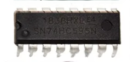
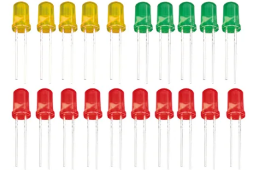
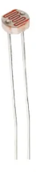

# TOPST D3 PROJECT

## Introduction

**In this project, we use the following products**

 
<a href="https://topst.ai/product"> TOPST D3 Board </a>

We used our company's TOPST D3 board as the mainboard.  It is a similar type of board to the Raspberry Pi,  allowing for various operations with sensors and other components.  For more details, please refer to the TOPST website.

  

 
<a href="https://www.keyestudio.com/products/keyestudio-raspberry-pi-4b-basic-starter-kit-python-programming-kitno-rpi-board-741"> Raspberry Pi Super Starter Kit KS3014 </a>

We utilized the sensors included in the Raspberry Pi Super Starter Kit.  If you are curious about the types of components,  please refer to the components from the respective manufacturer. <KS3014> 

 

 
 

## Sensor Used in Project
 

|NO.|PROJECT NAME|MODULE NAME|PICTURE||NO.|PROJECT NAME|SENSOR NAME|PICTURE|
|:------:|:------:|:------:|------|---|:------:|:------:|:------:|------|
|00|base-Library||||10|DotMatrix-74HC595N|Dotmatrix, Shift Resistor(IC chip)|

|
|01|GPIO-LED|LED|||11|Ultrasonic-Sensor|Ultrasonic Sensor||
|02|PWM-LED|LED|||12|Temperature-Sensor|Temperature Sensor, LCD Display, PCF8591|
 
|
|03|RGB-LED|RGB LED|||13|Motion-Sensor|Motion Sensor, LED|

|
|04|Active-Buzzer|Active Buzzer, Button|||14|Water-Level-Sensor|Water Level Sensor, LED, PCF8591|

|
|05|Passive-Buzzer|Passive Buzzer|||15|Flame-Sensor|Flame Sensor, PCF8591|

|
|06|7-Segment|7-Segment|||16|Photoresistor|Photoresistor, PCF8591|

|
|07|4Digit-Segment|4-Digit 7-Segmnet|||17|MQ2-Gas-Sensor|Gas Sensor, PCF8591|

|
|08|LCD-Display|LCD Display|||18|DCMotor+L293D|DC Motor, Button, L293D(IC chip)|

|
|09|GPIO-DotMatrix|Dotmatrix|||19|Stepper-Motor|Stepper Motor, Motor Driver|

|

