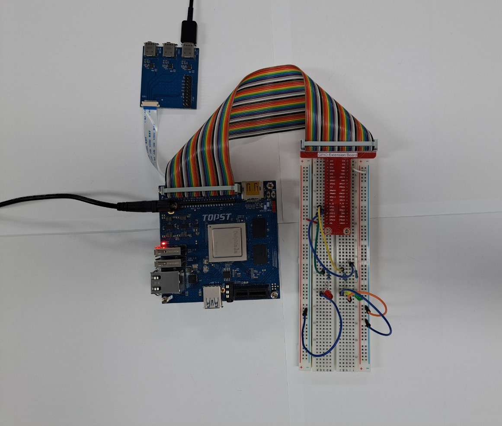
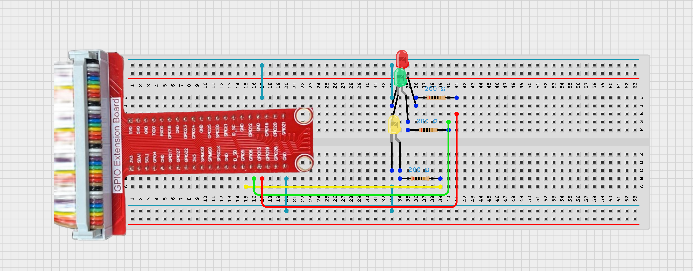

# TOPST D3_ LED Controller

## Introduction

In this document, we'll control led with gpio pin.
<br>
<br>

**1. LED ON/OFF**
    : To control the state of three LEDs (turning them ON and OFF) using the D3 board.
<br>

**2. Sequential LED Lighting**
    : To light up the three LEDs in a sequence, one after the other, using the D3 board.<br><br>
    
There are two ways to write code. 
The **first method** is to write and operate the GPIO code directly **without using libraries**. Use the first method to verify the fundamental operation of the board. 
The **second method** is to **use libraries**. Libraries allow you to operate components more conveniently

Additionally,
You can find Library at 00_Base_Library Documentary. When you want to learn more deeply reference them.


## Materials
|DEVICE|MODEL NAME|NUM|
|:------:|:------:|:------:|
|TOPST BOARD|D3|1|
|LED|RED, YELLOW, GREEN|3|
|GPIO Extention Board||1|
|WIRE|||
|RESISTOR|220OHM|3|


## Circuit Picture
<p align="center">

</p>
<p align="center">

</p>

### D3 BOARD

|PIN Number|PIN Name|Opponent's PIN|Connect Device|
|:------:|:------:|:------:|------|
|29|GPIO112|+|YELLOW LED|
|31|GPIO113|+|GREEN LED|
|33|GPIO114|+|RED LED|
|34|GND|-|RED LED, YELLOW LED, GREEN LED|

The negative (-) side of the resistor is connected to the ground, <br>
and the positive (+) side is connected to the GPIO pin.

## GPIO Pin Map
<br>

<p align="center">


<BR>

## 1. Code _ LED ON/OFF | LOOP
### Code without using libraries

```python
import sys
import os
import time
import signal

# Define paths for GPIO operations
GPIO_EXPORT_PATH = "/sys/class/gpio/export"
GPIO_UNEXPORT_PATH = '/sys/class/gpio/unexport'
GPIO_DIRECTION_PATH_TEMPLATE = '/sys/class/gpio/gpio{}/direction'
GPIO_VALUE_PATH_TEMPLATE = '/sys/class/gpio/gpio{}/value'
GPIO_BASE_PATH_TEMPLATE = '/sys/class/gpio/gpio{}'

# Check if the GPIO is already exported by verifying the base path
def is_gpio_exported(gpio_number): 
    gpio_base_path = GPIO_BASE_PATH_TEMPLATE.format(gpio_number)
    return os.path.exists(gpio_base_path)

# Export the GPIO if the base path does not exist
def export_gpio(gpio_number):
    if not is_gpio_exported(gpio_number):
        try:
            with open(GPIO_EXPORT_PATH, 'w') as export_file:
                export_file.write(str(gpio_number))
        except IOError as e:
            print(f"Error exporting GPIO: {e}")
            sys.exit(1)

# Unexport the GPIO
def unexport_gpio(gpio_number):
    try:
        with open(GPIO_UNEXPORT_PATH, 'w') as unexport_file:
            unexport_file.write(str(gpio_number))
    except IOError as e:
        print(f"Error unexporting GPIO: {e}")
        sys.exit(1)

# Set the direction of the GPIO (e.g., 'in' or 'out')
def set_gpio_direction(gpio_number, direction):
    gpio_direction_path = GPIO_DIRECTION_PATH_TEMPLATE.format(gpio_number)
    try:
        with open(gpio_direction_path, 'w') as direction_file:
            direction_file.write(direction)
    except IOError as e:
        print(f"Error setting GPIO direction: {e}")
        sys.exit(1)

# Set the value of the GPIO (e.g., 1 or 0)
def set_gpio_value(gpio_number, value):
    gpio_value_path = GPIO_VALUE_PATH_TEMPLATE.format(gpio_number)
    try:
        with open(gpio_value_path, 'w') as value_file:
            value_file.write(str(value))
    except IOError as e:
        print(f"Error setting GPIO value: {e}")
        sys.exit(1)

```


The GPIO Initialization Functions are **essential functions** that must always be included beforehand. <br>
***If you want to use these more conveniently, please use the distributed library.***
<br>
<br>

- Function to turn LED on or off
```python
def led_onff(gpio_number, direction, value):
    export_gpio(gpio_number)
    set_gpio_direction(gpio_number, direction)
    set_gpio_value(gpio_number, value)
```
- Function to LED Loop
```python
def gpio_loop(gpio_numbers):
    while 1:
        for i in range(len(gpio_numbers)):
            led_onff(gpio_numbers[i], "out", 1)
            time.sleep(1)
            led_onff(gpio_numbers[i], "out", 0)
```
- Main code starts here
```python
if __name__ == "__main__":

    if len(sys.argv) != 4 and len(sys.argv) != 3:
        print(f"Usage: {sys.argv[0]} <gpio_number,...> <direction> <value>")
        print(f"Example: {sys.argv[0]} 82,83,..,87 out 1")
        print(f"Example: {sys.argv[0]} 82,83,...,87 stack")
        sys.exit(1)

    gpio_numbers = sys.argv[1].split(',')
    direction = sys.argv[2]
    if len(sys.argv) == 3:
        value = sys.argv.append("1")
    value = int(sys.argv[3])

    try:
        if direction == "out":
            for i in range(len(gpio_numbers)):
                led_onff(gpio_numbers[i], direction, value)
        elif direction == 'loop':
            gpio_loop(gpio_numbers)
        elif direction == 'stack':
            gpio_stack(gpio_numbers)
            gpio_numbers.reverse()
            gpio_stack(gpio_numbers)


    except KeyboardInterrupt:
        for i in range(len(gpio_numbers)):
            set_gpio_value(gpio_numbers[i], 0)
            unexport_gpio(gpio_numbers[i])

    print(f"GPIO value: {value}")
    sys.exit(0)
```
<br>

**To run this script, you would use:**

```python
python3 script_name <gpio_numbers> <direction> <value>
python3 scrupt_name <value>
```
For example:
```python
python3 LED.py 17 out 1
python3 LED.py loop
```

### Code when using libraries
- Library
```python
from .. import GPIO_Library
from .. import PWM_Library

# GPIO LED
# led setting
def set_led_gpio(gpio_pin):
    GPIO_Library.export(gpio_pin)
    GPIO_Library.set_direction(gpio_pin, "out")

# led exiting
def quit_led_gpio(gpio_pin):
    GPIO_Library.unexport(gpio_pin)

# turn on led
def turn_on_gpio(gpio_pin):
    GPIO_Library.set_value(gpio_pin, 1)
    
# turn off led
def turn_off_gpio(gpio_pin):
    GPIO_Library.set_value(gpio_pin, 0)
```
- Controller
```python
from ..Library.Module import Led_Library
import time

if __name__ == "__main__":
    gpio_pin = 112
    second = 1

    Led_Library.set_led_gpio(gpio_pin) # regist gpio pin
    while True:
        Led_Library.turn_on_gpio(gpio_pin) # turn on led
        time.sleep(int(second))
        Led_Library.turn_off_gpio(gpio_pin) # turn off led
        time.sleep(int(second))
        if(KeyboardInterrupt):
            Led_Library.quit_led_gpio(gpio_pin) # unregist gpio pin
            break
```

**To run this script, you would use:**
Be sure to download script file at **00_Base_Library**.

Location of scripts can cause error.
When you write script yourself, modify **import path**.

```
cd {parent directory path which can include library and controller both}
python3 -m {controller script path}
```

For example:
```
cd TOPST
python3 -m TOPST.Controller.LED_Controller_GPIO
```
<br>

## Result Mov
- LED Blink<br>


- LED Loop<br>


