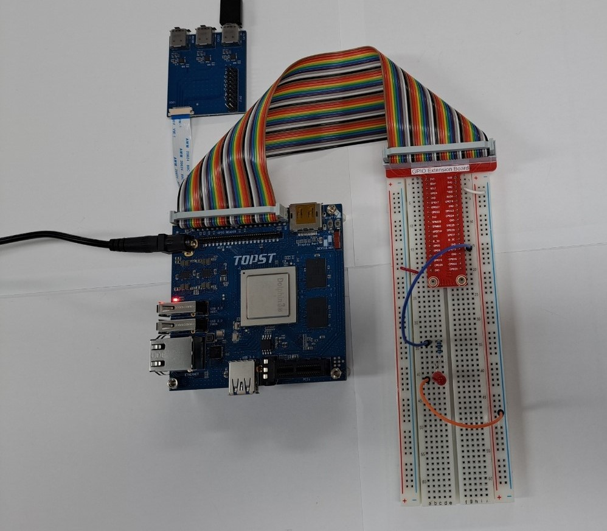
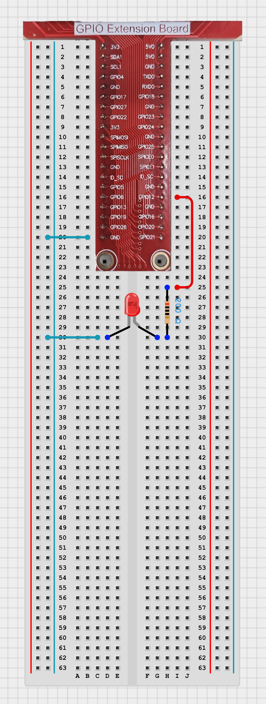

# TOPST D3_ PWM LED Controller

## Introduction

This document provides a guide on how to activate the LED PWM controller on the TOPST D3 board and outlines the expected results. The focus is on controlling the state of three LEDs using the D3 board and comparing different libraries or methods for GPIO control.
<br>
<br>
**1. LED ON/OFF <BR>**
    : To control the state of three LEDs (turning them ON and OFF) using the D3 board.
<br>

    
There are two ways to write code. <BR>
The **first method** is to write and operate the GPIO code directly **without using libraries**. Use the first method to verify the fundamental operation of the board. 
<bR>The **second method** is to **use libraries**. Libraries allow you to operate components more conveniently

Additionally,
You can find Library at 00_Base_Library Documentary. <BR>When you want to learn more deeply reference them.


## Materials
|DEVICE|MODEL NAME|NUM|
|:------:|:------:|:------:|
|TOPST BOARD|D3|1|
|LED||1|
|GPIO Extention Board||1|
|WIRE||
|RESISTOR|220OHM|1|


## Circuit Picture
<p align="center">

</p>
<p align="center">

</p>

### D3 BOARD

|PIN Number|PIN Name|Opponent's PIN|Connect Device|
|:------:|:------:|:------:|------|
|39|GND|-|LED|
|32|GPIO115|+|LED|

On the D3, there are three PWM pins, but the PWM pins 33 and 12 require kernel modifications to use. Therefore, we will use GPIO12 (pin 32).


## GPIO Pin Map
<br>

<p align="center">


<BR>

## 1. Code _ PWM LED ON/OFF
### Code without using libraries

```python
import time

PWM_CHIP_PATH = '/sys/class/pwm/pwmchip0/'
PWM_PIN = 2


def enable_pwm(pwm_pin):
    with open(PWM_CHIP_PATH + 'export', 'w') as export_file:
        export_file.write(str(pwm_pin))


def disable_pwm(pwm_pin):
    with open(PWM_CHIP_PATH + 'unexport', 'w') as unexport_file:
        unexport_file.write(str(pwm_pin))


def set_pwm_period(pwm_pin, period_ns):
    with open(PWM_CHIP_PATH + f'pwm{pwm_pin}/period', 'w') as period_file:
        period_file.write(str(period_ns))


def set_pwm_duty_cycle(pwm_pin, duty_cycle_ns):
    with open(PWM_CHIP_PATH + f'pwm{pwm_pin}/duty_cycle', 'w') as duty_cycle_file:
        duty_cycle_file.write(str(duty_cycle_ns))


def enable_pwm_output(pwm_pin):
    with open(PWM_CHIP_PATH + f'pwm{pwm_pin}/enable', 'w') as enable_file:
        enable_file.write('1')


def disable_pwm_output(pwm_pin):
    with open(PWM_CHIP_PATH + f'pwm{pwm_pin}/enable', 'w') as enable_file:
        enable_file.write('0')

```


The PWM Initialization Functions are **essential functions** that must always be included beforehand. <br>
***If you want to use these more conveniently, please use the distributed library.***
<br>
<br>

- Main code starts here
```python
if __name__ == '__main__':
    try:
        # Enable
        enable_pwm(PWM_PIN)

       
        set_pwm_period(PWM_PIN, 1000000000)  # 1초 period (1Hz frequency)
        set_pwm_duty_cycle(PWM_PIN, 500000000)  # 0.5초 duty cycle (50% duty cycle)
        enable_pwm_output(PWM_PIN)

        while True:
            print("\nSleep")
            time.sleep(1)

    except KeyboardInterrupt:
        disable_pwm_output(PWM_PIN)
        disable_pwm(PWM_PIN)
        print("\nPWM control stopped.")
```
<br>

**To run this script, you would use:**

```python
python3 script_name <gpio_numbers> <direction> <value>
```
For example:
```python
python3 LED_PWM.py 17 out 1
```

<br>

### When using libraries
- Library
```python
from .. import GPIO_Library
from .. import PWM_Library

#PWM LED
#led Setting
def set_led_pwm(channel):
    PWM_Library.export(channel)

# led exiting
def quit_led_pwm(channel):
    PWM_Library.unexport(channel)

# set led's pulse by second unit
def set_led_cycle(channel, second, cycle):
    PWM_Library.set_period_sec(channel, second)
    PWM_Library.set_cycle_sec(channel, cycle)
    
# set led's pulse by nano second unit
def set_led_cycle_ns(channel, nano_second, nano_cycle):
    PWM_Library.set_period_ns(channel, nano_second)
    PWM_Library.set_cycle_ns(channel, nano_cycle)

# turn on led
def turn_on_pwm(channel):
    PWM_Library.set_enable(channel, 1)

# turn off led
def turn_off_pwm(channel):
    PWM_Library.set_enable(channel, 0)
```
- Controller
```python
from ..Library.Module import Led_Library
import time

if __name__ == "__main__":
    
    channel = 2
    second = 3
    cycle = 1

    Led_Library.set_led_pwm(channel) # regist pwm channel
    Led_Library.set_led_cycle(channel, second, cycle) # set  led pulse cycle
    while True:
        Led_Library.turn_on_pwm(channel) # turn on led
        time.sleep(1)
```

**To run this script, you would use:**

Be sure to download script file at **00_Base_Library**.

Location of scripts can cause error.
When you write script yourself, modify **import path**.

```
cd {parent directory path which can include library and controller both}
python3 -m {controller script path}
```

For example:
```
cd TOPST
python3 -m TOPST.Controller.LED_Controller_PWM
```
<br>

## Result Mov

- LED PWM<br>

