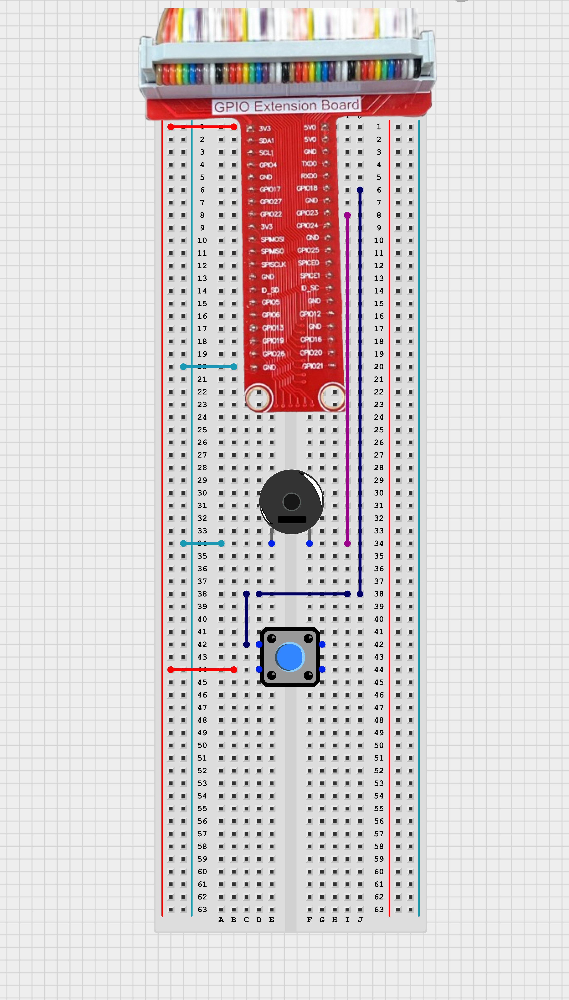

# TOPST D3_ Active buzzer

## Introduction

In this project, we will create a simple circuit that generates a sound using an active buzzer when a button is pressed.

**Buzzing**<br>: When the button is pressed, the active buzzer sounds
<BR>

There are two ways to write code. <bR>
The **first method** is to write and operate the GPIO code directly **without using libraries**. Use the first method to verify the fundamental operation of the board.<BR> 
The **second method** is to **use libraries**. Libraries allow you to operate components more conveniently

Additionally,<BR>
You can find Library at 00_Base_Library Documentary. When you want to learn more deeply reference them.


## Materials
|DEVICE|MODEL NAME|NUM|
|:------:|:------:|:------:|
|TOPST BOARD|D3|1|
|active buzzer||1|
|GPIO Extention Board||1|
|WIRE|||
|push button||1|


## Circuit Picture
<p align="center">

</p>
<p align="center">

</p>

### D3 BOARD

|PIN Number|PIN Name|Opponent's PIN|Connect Device|
|:------:|:------:|:------:|------|
|12|GPIO89|1|Button|
|14|GPIO90|1|Buzzer|
|1|3V|2|Button|
|39|GND|2|Buzzer|

**button**<br>
One pin of the button is connected to 3V, and the other pin is connected to PIN 12.<br> 
**active buzzer**<br>
The + pin of the buzzer is connected to PIN 14, and the other terminal is connected to GND.


## GPIO Pin Map
<br>

<p align="center">


<BR>

## 1. Code _ active buzzer with button
### Code without using libraries

```python
import sys
import os
import time
import signal

# Define paths for GPIO operations
GPIO_EXPORT_PATH = "/sys/class/gpio/export"
GPIO_UNEXPORT_PATH = '/sys/class/gpio/unexport'
GPIO_DIRECTION_PATH_TEMPLATE = '/sys/class/gpio/gpio{}/direction'
GPIO_VALUE_PATH_TEMPLATE = '/sys/class/gpio/gpio{}/value'
GPIO_BASE_PATH_TEMPLATE = '/sys/class/gpio/gpio{}'

button_gpio = 89  
buzzer_gpio = 90  

# Check if the GPIO is already exported by verifying the base path
def is_gpio_exported(gpio_number): 
    gpio_base_path = GPIO_BASE_PATH_TEMPLATE.format(gpio_number)
    return os.path.exists(gpio_base_path)

# Export the GPIO if the base path does not exist
def export_gpio(gpio_number):
    if not is_gpio_exported(gpio_number):
        try:
            with open(GPIO_EXPORT_PATH, 'w') as export_file:
                export_file.write(str(gpio_number))
        except IOError as e:
            print(f"Error exporting GPIO: {e}")
            sys.exit(1)

# Unexport the GPIO
def unexport_gpio(gpio_number):
    try:
        with open(GPIO_UNEXPORT_PATH, 'w') as unexport_file:
            unexport_file.write(str(gpio_number))
    except IOError as e:
        print(f"Error unexporting GPIO: {e}")
        sys.exit(1)

# Set the direction of the GPIO (e.g., 'in' or 'out')
def set_gpio_direction(gpio_number, direction):
    gpio_direction_path = GPIO_DIRECTION_PATH_TEMPLATE.format(gpio_number)
    try:
        with open(gpio_direction_path, 'w') as direction_file:
            direction_file.write(direction)
    except IOError as e:
        print(f"Error setting GPIO direction: {e}")
        sys.exit(1)

# Set the value of the GPIO (e.g., 1 or 0)
def set_gpio_value(gpio_number, value):
    gpio_value_path = GPIO_VALUE_PATH_TEMPLATE.format(gpio_number)
    try:
        with open(gpio_value_path, 'w') as value_file:
            value_file.write(str(value))
    except IOError as e:
        print(f"Error setting GPIO value: {e}")
        sys.exit(1)

# Get the value of the GPIO (e.g., 1 or 0)
def get_gpio_value(gpio_number):
    gpio_value_path = GPIO_VALUE_PATH_TEMPLATE.format(gpio_number)
    try:
        with open(gpio_value_path, 'r') as value_file:
            return value_file.read().strip()
    except IOError as e:
        print(f"Error getting GPIO value: {e}")
        sys.exit(1)

# Signal handler to cleanup on exit
def signal_handler(sig, frame):
    unexport_gpio(button_gpio)
    unexport_gpio(buzzer_gpio)
    sys.exit(0)

# Register the signal handler for cleanup
signal.signal(signal.SIGINT, signal_handler)

# Export and configure GPIOs
export_gpio(button_gpio)
export_gpio(buzzer_gpio)
set_gpio_direction(button_gpio, 'in')
set_gpio_direction(buzzer_gpio, 'out')
```


The GPIO Initialization Functions are **essential functions** that must always be included beforehand. <br>
***If you want to use these more conveniently, please use the distributed library.***
<br>
<br>


- Main code starts here
```python
try:
    while True:
        button_state = get_gpio_value(button_gpio)
        if button_state == '0':  
            set_gpio_value(buzzer_gpio, 0)  
            print("Button not pressed, buzzer off")
        else:
            set_gpio_value(buzzer_gpio, 1)  
            print("Button pressed, buzzer on")
        time.sleep(0.1)

except KeyboardInterrupt:
    signal_handler(signal.SIGINT, None)
```
<br>

**To run this script, you would use:**

```python
python3 script_name
```
For example:
```python
python3 active_buzzer.py
```

<br>

### Code When using libraries
- Library
```python
from .. import GPIO_Library
from .. import PWM_Library

#GPIO Buzzer
# Set a buzzer gpio
def set_buzzer_gpio(gpio_pin):
    GPIO_Library.export(gpio_pin)
    GPIO_Library.set_direction(gpio_pin, "out")

# Quit a buzzer gpio
def quit_buzzer_gpio(gpio_pin):
    GPIO_Library.unexport(gpio_pin)

# make a buzzer sound
def turn_on_gpio(gpio_pin):
    GPIO_Library.set_value(gpio_pin , 1)

# make a buzzer quiet
def turn_off_gpio(gpio_pin):
    GPIO_Library.set_value(gpio_pin , 0)
```
- Controller
```python
from ..Library.Module import Buzzer_Library
import time
if __name__ == "__main__":

    gpio_pin = 112 # gpio pin which connected with buzzer
    second = 1 # how long turn on and off

    Buzzer_Library.set_buzzer_gpio(gpio_pin) # regist buzzer device
    
    while True:
        Buzzer_Library.turn_on_gpio(gpio_pin) # turn off buzzer
        time.sleep(second)
        Buzzer_Library.turn_off_gpio(gpio_pin) # turn off buzzer
        time.sleep(second)
```
**To run this script, you would use:**

Be sure to download script file at **00_Base_Library**.

Location of scripts can cause error.

When you write script yourself, modify **import path**.

```
cd {parent directory path which can include library and controller both}
python3 -m {controller script path}
```

For example:
```
cd TOPST
python3 -m TOPST.Controller.Buzzer_Controller_GPIO
```
<br>

## Result Mov

- active buzzer <br>
