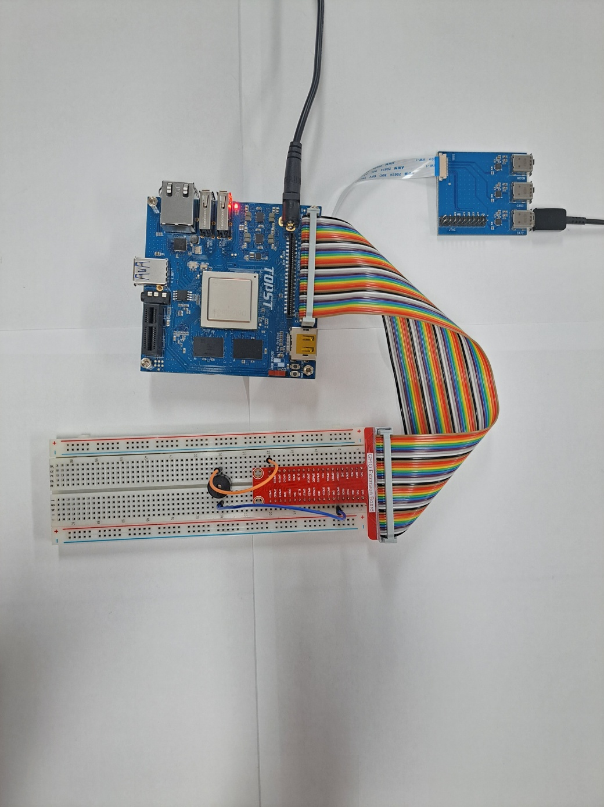
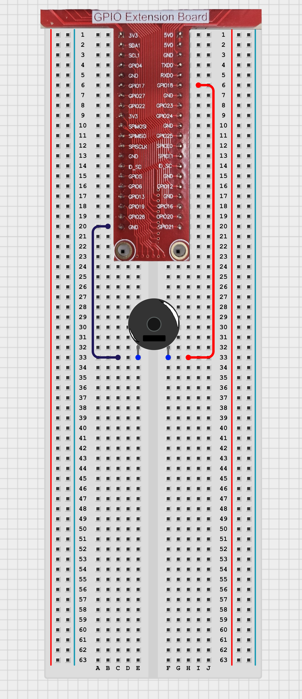

# TOPST D3_ Passive buzzer

## Introduction

A passive buzzer is an electronic device that produces sound based on an external driving signal. Unlike active buzzers, which generate sound using an internal oscillator, passive buzzers require an external AC signal to produce sound.
In this document, we'll control a passive buzzer using GPIO pins.

**1. Buzzer ON/OFF** <br>: To control the state of the passive buzzer (turning it ON and OFF) using the D3 board.
<br>

**2. Generating Tones**<Br>
    : To generate different tones and melodies with the passive buzzer using the D3 board.<br>
<Br>
There are two ways to write code. <br>
The **first method** is to write and operate the GPIO code directly **without using flibraries**. Use the first method to verify the fundamental operation of the board.<Br> 
The **second method** is to **use libraries**. Libraries allow you to operate components more conveniently

Additionally,<Br>
You can find Library at 00_Base_Library Documentary. When you want to learn more deeply reference them.


## Materials
|DEVICE|MODEL NAME|NUM|
|:------:|:------:|:------:|
|TOPST BOARD|D3|1|
|passive buzzer||1|
|GPIO Extention Board||1|
|WIRE|


## Circuit Picture
<p align="center">

</p>
<p align="center">

</p>

### D3 BOARD

|PIN Number|PIN Name|Opponent's PIN|Connect Device|
|:------:|:------:|:------:|------|
|12|GPIO89||buzzer|
|39|GND||buzzer|

Connect one side of the buzzer to GND and the other side to GPIO18 (pin 12). 

## GPIO Pin Map
<br>

<p align="center">


<BR>

## 1. Code_ Passive buzzer
### Code without using libraries

```python
import sys
import os
import time


GPIO_EXPORT_PATH = "/sys/class/gpio/export"
GPIO_UNEXPORT_PATH = "/sys/class/gpio/unexport"
GPIO_DIRECTION_PATH_TEMPLATE = "/sys/class/gpio/gpio{}/direction"
GPIO_VALUE_PATH_TEMPLATE = "/sys/class/gpio/gpio{}/value"
GPIO_BASE_PATH_TEMPLATE = "/sys/class/gpio/gpio{}"

FREQUENCIES = {
    'C': 261.63,  
    'D': 293.66,  
    'E': 329.63,  
    'F': 349.23,  
    'G': 392.00,  
    'A': 440.00,  
    'B': 493.88,  
    'C5': 523.25  
}

def is_gpio_exported(gpio_number):
    gpio_base_path = GPIO_BASE_PATH_TEMPLATE.format(gpio_number)
    return os.path.exists(gpio_base_path)

def export_gpio(gpio_number):
    if not is_gpio_exported(gpio_number):
        try:
            with open(GPIO_EXPORT_PATH, 'w') as export_file:
                export_file.write(str(gpio_number))
        except IOError as e:
            print(f"Error exporting GPIO {gpio_number}: {e}")
            sys.exit(1)

def unexport_gpio(gpio_number):
    try:
        with open(GPIO_UNEXPORT_PATH, 'w') as unexport_file:
            unexport_file.write(str(gpio_number))
    except IOError as e:
        print(f"Error unexporting GPIO {gpio_number}: {e}")
        sys.exit(1)

def set_gpio_direction(gpio_number, direction):
    gpio_direction_path = GPIO_DIRECTION_PATH_TEMPLATE.format(gpio_number)
    try:
        with open(gpio_direction_path, 'w') as direction_file:
            direction_file.write(direction)
    except IOError as e:
        print(f"Error setting GPIO {gpio_number} direction to {direction}: {e}")
        sys.exit(1)

def set_gpio_value(gpio_number, value):
    gpio_value_path = GPIO_VALUE_PATH_TEMPLATE.format(gpio_number)
    try:
        with open(gpio_value_path, 'w') as value_file:
            value_file.write(str(value))
    except IOError as e:
        print(f"Error setting GPIO {gpio_number} value to {value}: {e}")
        sys.exit(1)

```


The GPIO Initialization Functions are **essential functions** that must always be included beforehand. <br>
***If you want to use these more conveniently, please use the distributed library.***
<br>
<br>


- Function to turn passive buzzer
```python
def play_tone(gpio_number, frequency, duration):
    period = 1.0 / frequency
    half_period = period / 2
    end_time = time.time() + duration

    while time.time() < end_time:
        set_gpio_value(gpio_number, 1)
        time.sleep(half_period)
        set_gpio_value(gpio_number, 0)
        time.sleep(half_period)
```
- Main code starts here
```python
if __name__ == "__main__":
    gpio_pin = 89  

    try:
        export_gpio(gpio_pin)
        set_gpio_direction(gpio_pin, "out")

        for note, freq in FREQUENCIES.items():
            print(f"Playing {note} at {freq} Hz") 
            play_tone(gpio_pin, freq, 0.5)
            time.sleep(0.1)

    except KeyboardInterrupt:
        print("\nOperation stopped by User")
    except Exception as e:
        print(f"An error occurred: {e}")
    finally:
        unexport_gpio(gpio_pin)

    sys.exit(0)
```
<br>

**To run this script, you would use:**

```python
python3 script_name
```
For example:
```python
python3 passive_buzzer.py
```

<br>

### Code When using libraries
- Library
```python
from .. import GPIO_Library
from .. import PWM_Library

#PWM Buzzer
# Set a buzzer pwm
def set_buzzer_pwm(channel):
    PWM_Library.export(channel)

# Quit a buzzer pwm
def quit_buzzer_pwm(channel):
    PWM_Library.unexport(channel)

# Set pwm pulse's hz
def set_tone_pwm(channel, hz):
    PWM_Library.set_period_sec(channel, hz)
    PWM_Library.set_cycle_sec(channel, hz)    

# make a buzzer sound
def turn_on_pwm(channel):
    PWM_Library.set_enable(channel, 1)

# make a buzzer quiet
def turn_off_pwm(channel):
    PWM_Library.set_enable(channel, 0)
```

- Controller
```python
from ..Library.Module import Buzzer_Library

if __name__ == "__main__":
    
    gpio_pin = 112
    channel = 2
    hz = 3

    Buzzer_Library.set_buzzer_pwm(channel) # regist buzzer pwm channel
    Buzzer_Library.turn_on_pwm(channel) # pwm signal enable
    while True:
        Buzzer_Library.set_tone_pwm(channel, hz) # set pwm signal hz
        if(input(hz)=="q"):
            Buzzer_Library.turn_off_pwm(channel) # turn off buzzer
        else:
            Buzzer_Library.turn_on_gpio(channel) # turn on buzzer
```
**To run this script, you would use:**

Be sure to download script file at **00_Base_Library**.

Location of scripts can cause error.

When you write script yourself, modify **import path**.

```
cd {parent directory path which can include library and controller both}
python3 -m {controller script path}
```

For example:
```
cd TOPST
python3 -m TOPST.Controller.Buzzer_Controller_PWM
```
<br>

## Result Mov

- passive_buzzer(piano song)<br>

