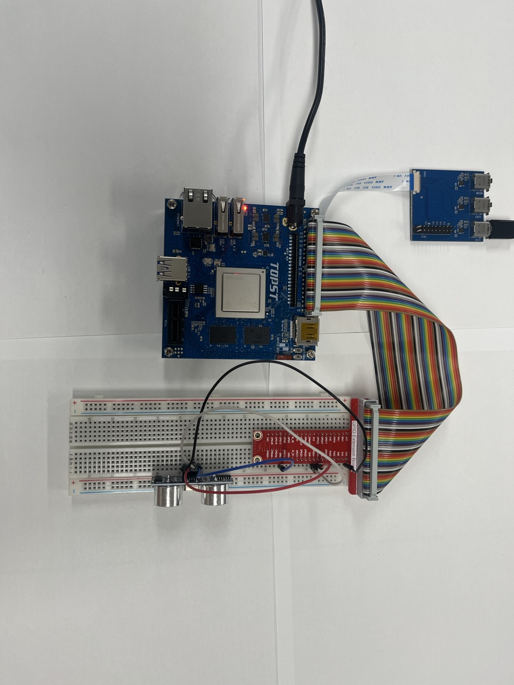
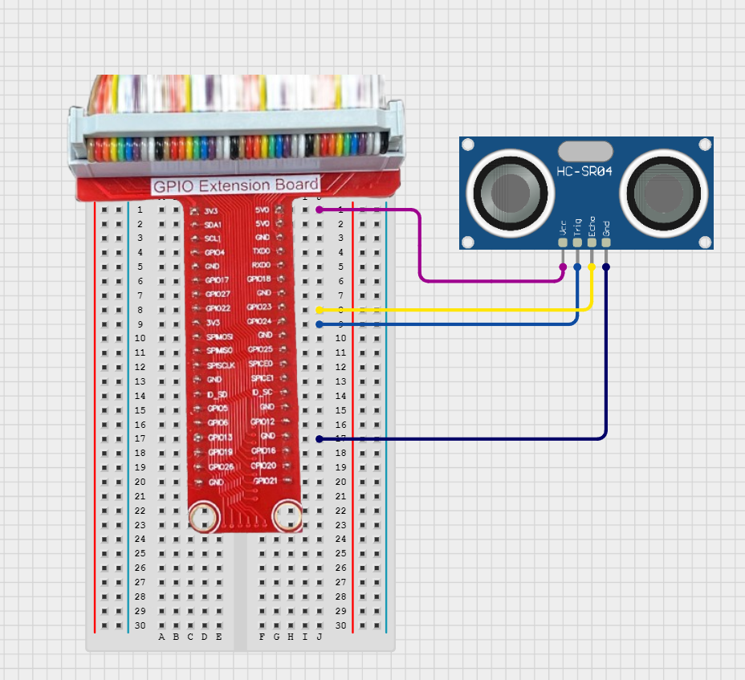

# TOPST D3_ Ultrasonic sensor

## Introduction

In this document, we'll control an ultrasonic sensor (HC-SR04) with GPIO pins.
<br>

**1. Real-time Distance Measurement**<BR>
: To continuously measure the distance in real-time as the sensor or object moves, using the D3 board.<br>
    
There are two ways to write code. <BR>
The **first method** is to write and operate the GPIO code directly **without using libraries**. Use the first method to verify the fundamental operation of the board.<BR> 
The **second method** is to **use libraries**. Libraries allow you to operate components more conveniently<BR>

Additionally,<bR>
You can find Library at 00_Base_Library Documentary. When you want to learn more deeply reference them.


## Materials
|DEVICE|MODEL NAME|NUM|
|:------:|:------:|:------:|
|TOPST BOARD|D3|1|
|HC-SR04 ultrasonic sensor||1|
|GPIO Extention Board||1|
|WIRE|||


## Circuit Picture
<p align="center">

</p>
<p align="center">

</p>

### D3 BOARD

|PIN Number|PIN Name|Opponent's PIN|Connect Device|
|:------:|:------:|:------:|------|
|16|GPIO90|ECHO|HC-SR04|
|18|GPIO65|TRIG|HC-SR04|
|2|5V|VCC|HC-SR04|
|34|GND|GND|HC-SR04|

Connect the VCC pin of the ultrasonic sensor to 5V, the GND pin to GND, <BR>the trigger pin to pin 18, and the echo pin to pin 16.

## GPIO Pin Map
<br>

<p align="center">


<BR>

## 1. Code _ Continuously measure the distance in real-time.
### Code without using libraries

```python
import sys
import os
import time

GPIO_EXPORT_PATH = "/sys/class/gpio/export"
GPIO_UNEXPORT_PATH = "/sys/class/gpio/unexport"
GPIO_DIRECTION_PATH_TEMPLATE = "/sys/class/gpio/gpio{}/direction"
GPIO_VALUE_PATH_TEMPLATE = "/sys/class/gpio/gpio{}/value"
GPIO_BASE_PATH_TEMPLATE = "/sys/class/gpio/gpio{}"

def is_gpio_exported(gpio_number):
    gpio_base_path = GPIO_BASE_PATH_TEMPLATE.format(gpio_number)
    return os.path.exists(gpio_base_path)

def export_gpio(gpio_number):
    if not is_gpio_exported(gpio_number):
        try:
            with open(GPIO_EXPORT_PATH, 'w') as export_file:
                export_file.write(str(gpio_number))
        except IOError as e:
            print(f"Error exporting GPIO {gpio_number}: {e}")
            sys.exit(1)

def unexport_gpio(gpio_number):
    try:
        with open(GPIO_UNEXPORT_PATH, 'w') as unexport_file:
            unexport_file.write(str(gpio_number))
    except IOError as e:
        print(f"Error unexporting GPIO {gpio_number}: {e}")
        sys.exit(1)

def set_gpio_direction(gpio_number, direction):
    gpio_direction_path = GPIO_DIRECTION_PATH_TEMPLATE.format(gpio_number)
    try:
        with open(gpio_direction_path, 'w') as direction_file:
            direction_file.write(direction)
    except IOError as e:
        print(f"Error setting GPIO {gpio_number} direction to {direction}: {e}")
        sys.exit(1)

def set_gpio_value(gpio_number, value):
    gpio_value_path = GPIO_VALUE_PATH_TEMPLATE.format(gpio_number)
    try:
        with open(gpio_value_path, 'w') as value_file:
            value_file.write(str(value))
    except IOError as e:
        print(f"Error setting GPIO {gpio_number} value to {value}: {e}")
        sys.exit(1)

def read_gpio_value(gpio_number):
    gpio_value_path = GPIO_VALUE_PATH_TEMPLATE.format(gpio_number)
    try:
        with open(gpio_value_path, 'r') as value_file:
            return value_file.read().strip()
    except IOError as e:
        print(f"Error reading GPIO {gpio_number} value: {e}")
        sys.exit(1)
```


The Functions are **essential functions** that must always be included beforehand. <br>
***If you want to use these more conveniently, please use the distributed library.***
<br>
<br>

- Function to measure distance in real-time
```python
def read_ultrasonic_sensor(trigger_pin, echo_pin, timeout=1.0):
    export_gpio(trigger_pin)
    export_gpio(echo_pin)
    set_gpio_direction(trigger_pin, "out")
    set_gpio_direction(echo_pin, "in")

    set_gpio_value(trigger_pin, 0)
    time.sleep(0.000002)  

    set_gpio_value(trigger_pin, 1)
    time.sleep(0.00001) 
    set_gpio_value(trigger_pin, 0)

    start_time = time.time()
    timeout_start = time.time()
    while read_gpio_value(echo_pin) == '0':
        if time.time() - timeout_start > timeout:
            print("Timeout waiting for echo start")
            unexport_gpio(trigger_pin)
            unexport_gpio(echo_pin)
            return None
        start_time = time.time()

    timeout_start = time.time()
    while read_gpio_value(echo_pin) == '1':
        if time.time() - timeout_start > timeout:
            print("Timeout waiting for echo end")
            unexport_gpio(trigger_pin)
            unexport_gpio(echo_pin)
            return None
        stop_time = time.time()

    elapsed_time = stop_time - start_time
    distance = (elapsed_time * 34300) / 2  

    unexport_gpio(trigger_pin)
    unexport_gpio(echo_pin)

    return distance
```
- Main code starts here
```python
    if __name__ == "__main__":
    if len(sys.argv) != 3:
        print(f"Usage: {sys.argv[0]} <trigger_pin> <echo_pin>")
        print(f"Example: {sys.argv[0]} 65 90")
        sys.exit(1)

    try:
        trigger_pin = int(sys.argv[1])
        echo_pin = int(sys.argv[2])
    except ValueError:
        print("Invalid pin number. Pins must be integers.")
        sys.exit(1)

    try:
        while True:
            distance = read_ultrasonic_sensor(trigger_pin, echo_pin)
            if distance is not None:
                print(f"Distance: {distance:.2f} cm")
            else:
                print("Failed to measure distance")
            time.sleep(1) 
    except KeyboardInterrupt:
        unexport_gpio(trigger_pin)
        unexport_gpio(echo_pin)
        print("\nMeasurement stopped by User")
    except Exception as e:
        print(f"An error occurred: {e}")
        unexport_gpio(trigger_pin)
        unexport_gpio(echo_pin)
    sys.exit(0)
```
<br>

**To run this script, you would use:**

```python
python3 script_name
```

For example:
```python
python3 ultrasonic_real_time.py
```


### Code When using libraries
- Library
```python
from .. import GPIO_Library as gpio
import time

# set device for use device
def set_device(echo_pin, trigger_pin):
    gpio.export(echo_pin)
    gpio.set_direction(echo_pin, "in")
    gpio.export(trigger_pin)
    gpio.set_direction(trigger_pin, "out")

# read distance by device
def read_distance(echo_pin, trigger_pin, timeout = 0.05):
    gpio.set_value(trigger_pin, 0) # start trigger signal
    time.sleep(0.000001)
    gpio.set_value(trigger_pin, 1) # send trigger signal
    time.sleep(0.00001)
    gpio.set_value(trigger_pin, 0) # wait for signal
    time.sleep(0.0002)
    return measure_distance(echo_pin, timeout)

def measure_distance(echo_pin, timeout):
    start = time.time()
    timeout_start = time.time()
    while gpio.get_value(echo_pin) == '0': #wait for get signal by echo_pin
        if time.time() - timeout_start > timeout:
            return None
        start = time.time()
    
    timeout_start = time.time()
    while gpio.get_value(echo_pin) == '1': #time check for measure how long
        if time.time() - timeout_start > timeout:
            return None 
        stop = time.time()
    time.sleep(0.01)
    eslapse = stop - start # calculate eslapsed time
    return eslapse * 34300 / 2  # calculate distance by eslapsed time

# quit device after using device
def disable_device(echo_pin, trigger_pin):
    gpio.unexport(echo_pin)
    gpio.unexport(trigger_pin)
```
- Controller
```python
from ..Library.Module import HC_SR04_Library as hc

echo = 112
trig = 113

if __name__ == "__main__":
    hc.set_device(echo, trig) # regist hc-sr04
    print(hc.read_distance(echo, trig)) # read data from hc-sr04
    hc.disable_device(echo, trig) # unregist hc-sr04
```
**To run this script, you would use:**

Be sure to download script file at **00_Base_Library**.

Location of scripts can cause error.

When you write script yourself, modify **import path**.

```
cd {parent directory path which can include library and controller both}
python3 -m {controller script path}
```

For example:
```
cd TOPST
python3 -m TOPST.Controller.HC_SR04_Controller
```
<br>

## Result Mov
- Ultrasonic sensor<br>
