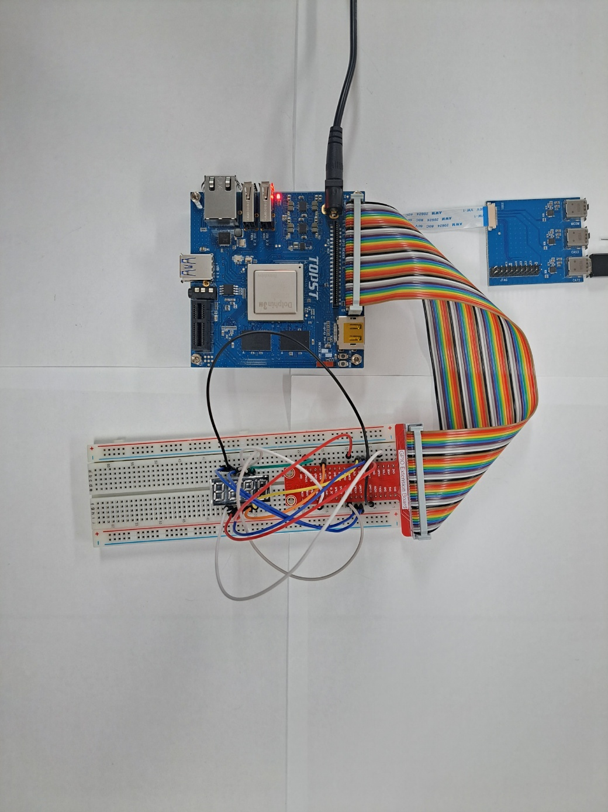
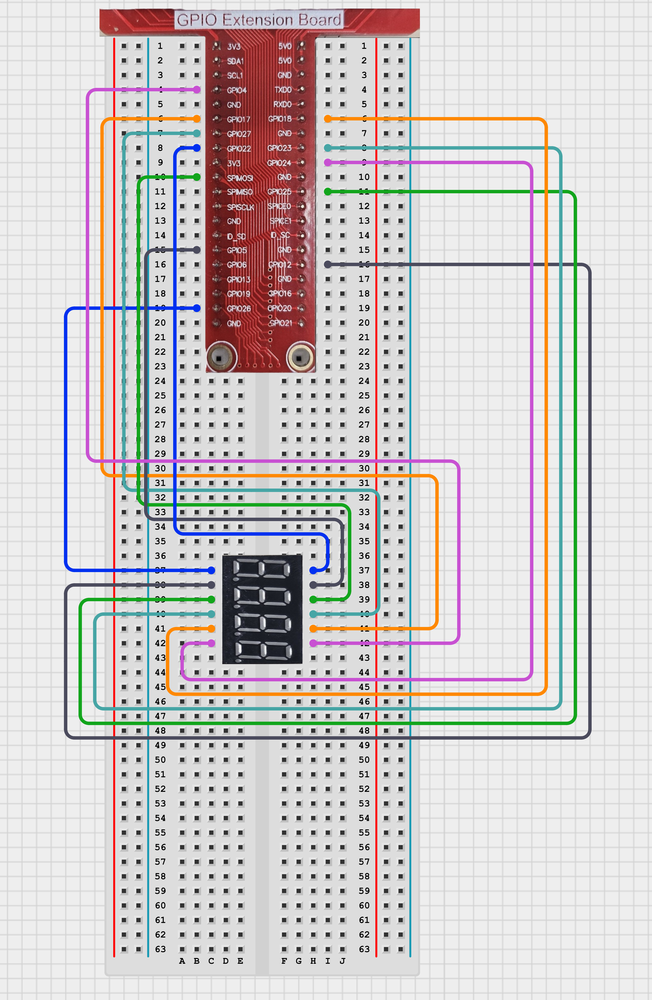

# TOPST D3_ 4 Digit 7 Segment

## Introduction

In this document, we'll control Segment with gpio pin.
<br><br>
**4-Digit 7-Segment**<br>
    : To control a 4-digit 7-segment display to function as both a timer and a clock using the D3 board.<br>
    
There are two ways to write code. <br>
The **first method** is to write and operate the GPIO code directly **without using libraries**. Use the first method to verify the fundamental operation of the board. <Br>
The **second method** is to **use libraries**. Libraries allow you to operate components more conveniently

Additionally,<Br>
You can find Library at 00_Base_Library Documentary. When you want to learn more deeply reference them.


## Materials
|DEVICE|MODEL NAME|NUM|
|:------:|:------:|:------:|
|TOPST BOARD|D3|1|
|4-Digit 7-Segment||1|   
|GPIO Extention Board||1|
|WIRE|||


## Circuit Picture
<p align="center">

</p>
<p align="center">

</p>


### D3 BOARD

|PIN Number|PIN Name|Opponent's PIN|Connect Device|PIN Number|PIN Name|Opponent's PIN|Connect Device|
|:------:|:------:|:------:|------|:------:|:------:|:------:|------|
|19|GPIO63|10(F)|7-seg|11|GPIO84|8(D3)|7-seg|
|18|GPIO65|6(D4)|7-seg|13|GPIO85|9(D2)|7-seg|
|22|GPIO66|3(dec)|7-seg|14|GPIO86|12(D1)|7-seg|
|7|GPIO83|7(B)|7-seg|12|GPIO89|5(G)|7-seg|
|16|GPIO90|4(C)|7-seg|29|GPIO112|11(A)|7-seg|
|32|GPIO115|2(D)|7-seg|37|GPIO117|1(E)|7-seg|


## GPIO Pin Map
<br>

<p align="center">


<BR>

## 1. Code _ 4-Digit 7-Segment
### Code without using libraries

```python
import sys
import os
import time
import signal

# Define paths for GPIO operations
GPIO_EXPORT_PATH = "/sys/class/gpio/export"
GPIO_UNEXPORT_PATH = '/sys/class/gpio/unexport'
GPIO_DIRECTION_PATH_TEMPLATE = '/sys/class/gpio/gpio{}/direction'
GPIO_VALUE_PATH_TEMPLATE = '/sys/class/gpio/gpio{}/value'
GPIO_BASE_PATH_TEMPLATE = '/sys/class/gpio/gpio{}'

# Check if the GPIO is already exported by verifying the base path
def is_gpio_exported(gpio_number): 
    gpio_base_path = GPIO_BASE_PATH_TEMPLATE.format(gpio_number)
    return os.path.exists(gpio_base_path)

# Export the GPIO if the base path does not exist
def export_gpio(gpio_number):
    if not is_gpio_exported(gpio_number):
        try:
            with open(GPIO_EXPORT_PATH, 'w') as export_file:
                export_file.write(str(gpio_number))
        except IOError as e:
            print(f"Error exporting GPIO: {e}")
            sys.exit(1)

# Unexport the GPIO
def unexport_gpio(gpio_number):
    try:
        with open(GPIO_UNEXPORT_PATH, 'w') as unexport_file:
            unexport_file.write(str(gpio_number))
    except IOError as e:
        print(f"Error unexporting GPIO: {e}")
        sys.exit(1)

# Set the direction of the GPIO (e.g., 'in' or 'out')
def set_gpio_direction(gpio_number, direction):
    gpio_direction_path = GPIO_DIRECTION_PATH_TEMPLATE.format(gpio_number)
    try:
        with open(gpio_direction_path, 'w') as direction_file:
            direction_file.write(direction)
    except IOError as e:
        print(f"Error setting GPIO direction: {e}")
        sys.exit(1)

# Set the value of the GPIO (e.g., 1 or 0)
def set_gpio_value(gpio_number, value):
    gpio_value_path = GPIO_VALUE_PATH_TEMPLATE.format(gpio_number)
    try:
        with open(gpio_value_path, 'w') as value_file:
            value_file.write(str(value))
    except IOError as e:
        print(f"Error setting GPIO value: {e}")
        sys.exit(1)
```


The GPIO Initialization Functions are **essential functions** that must always be included beforehand. <br>
***If you want to use these more conveniently, please use the distributed library.***
<br>
<br>


- control display
```python
def gpio_num_on(gpio_num):
    for i in range(len(gpio_num)):
        set_gpio_value(gpio_num[i], 1)

def gpio_num_off(gpio_num):
    for i in range(len(gpio_num)):
        set_gpio_value(gpio_num[i], 0)

def gpio_digit_on(gpio_digit):
    set_gpio_value(gpio_digit, 0)

def gpio_digit_off(gpio_digit):
    set_gpio_value(gpio_digit, 1)

def gpio_turn_off():
    for i in [a,b,c,d,e,f,g,dp]:
        gpio_digit_on(i)
    for i in [d1,d2,d3,d4]:
        gpio_digit_off(i)

def display(gpio_digit, gpio_array):
    gpio_turn_off() # 모든 자리 끄기
    
    gpio_digit_on(gpio_digit)
    gpio_num_on(gpio_array)

def display_run(num):
    display(d1, gpio_array[(num//1000)])
    display(d2, gpio_array[(num//100)%10])
    display(d3, gpio_array[(num//10)%10])
    display(d4, gpio_array[(num)%10]) 
```
- Main code starts here
```python
# GPIO PIN NUMBER
d1 = 86
d2 = 85
d3 = 84
d4 = 65

a = 112
b = 83
c = 90
d = 115
e = 117
f = 63
g = 89
dp = 66

if sys.argv[1] == "timer":
  num = 0
  time_1 = time.time() + 1
  while(num < 10000):
    display_run(num)
    if time.time() > time_1:
      num += 1
      time_1 = time.time() + 1

if sys.argv[1] == "clock":      
  while(True):
    h = time.localtime().tm_hour
    m = time.localtime().tm_min
    num = h*100+m

    display(d2,[dp])          
    display_run(num)

```

<br>

**To run this script, you would use:**

```python
python3 script_name <value>
```
For example:
```python
python3 4digitSegment.py timer # timer 실행
python3 4digitSegment.py clock # clock 실행
```

<br>

### Code When using libraries
- Library
```python
import GPIO_Library as gpio

# regist segment_pins and digit_pins
def set_device(segment_pins, digit_pins):
    for pin in segment_pins:
        gpio.export(pin)
        gpio.set_direction(pin, 'out')
        gpio.set_value(pin, 0)
    for pin in digit_pins:
        gpio.export(pin)
        gpio.set_direction(pin, 'out')
        gpio.set_value(pin, 0)

# unregist segment pins and digit pins
def quie_device(segment_pins, digit_pins):
    for pin in segment_pins:
        gpio.unexport(pin)
    for pin in digit_pins:
        gpio.unexport(pin)

# turn on digit and segment
def turn_on_digit(segment_pins, digit_pins):
    for pin in digit_pins:
        gpio.set_value(pin, 0)
    for pin in segment_pins:
        gpio.set_value(pin, 1)

# turn off digit and segment
def turn_off_digit(segment_pins, digit_pins):
    for pin in digit_pins:
        gpio.set_value(pin, 1)
    for pin in segment_pins:
        gpio.set_value(pin, 0)

# turn off all display and turn on data
def display(segment_pins, digit_pins, data_segment, data_digit):
    turn_off_digit(digit_pins, segment_pins)
    turn_on_digit(data_segment, data_digit)
```
- Controller
```python
from ..Library.Module import Digit_Segment_Library as digit
import time

digit_pins = [86, 85, 84, 65] # d1, d2, d3, d4
segment_pins = [112, 83, 90, 115, 117, 63, 89, 66] # a, b, c, d, e, f, g, dp

gpio_array = [
    [112,83,90,115,117,63], #0
    [83,90], #1
    [112,83,115,117,63], #2
    [112,83,90,115,63], #3
    [83,90,63,89], #4
    [112,90,115,63,89], #5
    [112,90,115,117,63,89], #6
    [112,83,90], #7
    [112,83,90,115,117,63,89], #8
    [112,83,90,115,63,89]  #9
]

if __name__ == "__main__":
        digit.set_device(segment_pins, digit_pins) # regist device
        digit.turn_off_digit(segment_pins, digit_pins)

        num = 0
        time_1 = time.time() + 1
        while(num < 10000): # display num
            digit.display(digit_pins[0], gpio_array[(num//1000)])
            digit.display(digit_pins[1], gpio_array[(num//100)%10])
            digit.display(digit_pins[2], gpio_array[(num//10)%10])
            digit.display(digit_pins[3], gpio_array[(num)%10]) 
            if time.time() > time_1:
                num += 1
                time_1 = time.time() + 1 # every second num ++
        
        digit.quit_device(segment_pins, digit_pins) # unregist device

```
**To run this script, you would use:**

Be sure to download script file at **00_Base_Library**.

Location of scripts can cause error.

When you write script yourself, modify **import path**.

```
cd {parent directory path which can include library and controller both}
python3 -m {controller script path}
```

For example:
```
cd TOPST
python3 -m TOPST.Controller.Buzzer_Controller_GPIO
```
<br>

## Result Mov

- 4_digit_8_Segment<br>

