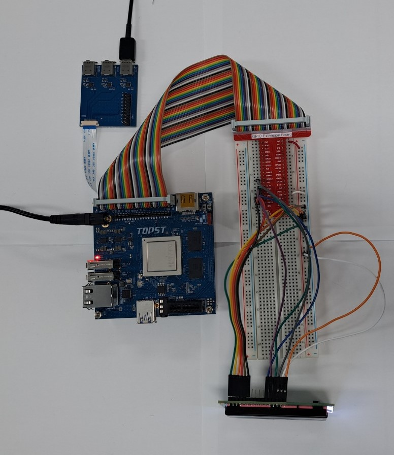
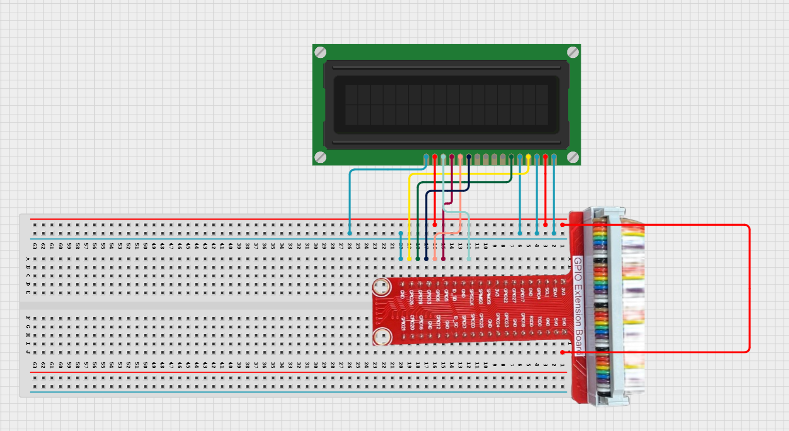
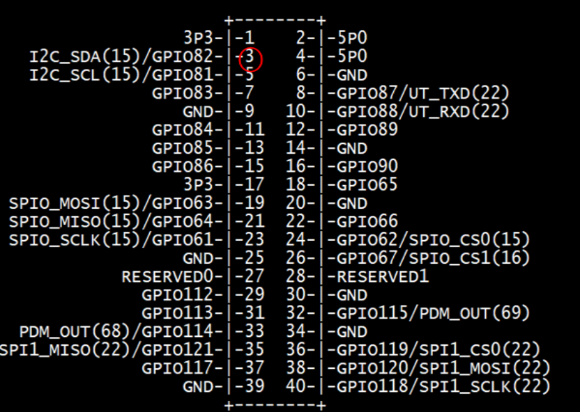

# TOPST D _ LCD Dispay

## Introduction

In this document, we'll explore the process of testing and operating an LCD display.

**1. LCD Display Operation Test** <BR>
    : To perform a functional test of the LCD display to ensure it is working correctly and capable of displaying information.

By following these steps, we will be able to verify the functionality of the LCD display and effectively visualize real-time data.
    
There are two ways to write code. <BR>
The **first method** is to write and operate the GPIO code directly **without using libraries**. Use the first method to verify the fundamental operation of the board.<br> 
The **second method** is to **use libraries**. Libraries allow you to operate components more conveniently<Br>

Additionally,<Br>
You can find Library at 00_Base_Library Documentary. When you want to learn more deeply reference them.


## Materials
|DEVICE|MODEL NAME|NUM|
|:------:|:------:|:------:|
|TOPST BOARD|D3|1|
|GPIO Extention Board||1|
|WIRE|||
|1602 LCD display||1|


## Circuit Picture
<p align="center">

</p>
<p align="center">

</p>

### D3 BOARD

|PIN Number|PIN Name|Opponent's PIN|Connect Device|PIN Number|PIN Name|Opponent's PIN|Connect Device|
|:------:|:------:|:------:|------|:------:|:------:|:------:|------|
|VSS|LCD|GND|GPIO BOARD|RW|LCD|GND|GPIO BOARD|
|VDD|LCD|5V5|GPIO BOARD|E|LCD|GPIO121|GPIO BOARD|
|VO|LCD|GND|GPIO BOARD|D0|LCD|-|GPIO BOARD|
|RS|LCD|GPIO117|GPIO BOARD|D1|LCD|-|GPIO BOARD|
|D2|LCD|-|GPIO BOARD|D3|LCD|-|GPIO BOARD|
|D4|LCD|GPIO114|GPIO BOARD|D5|LCD|GPIO113|GPIO BOARD|
|D6|LCD|GPIO112|GPIO BOARD|D7|LCD|GPIO61|GPIO BOARD|
|+|LED|5V|GPIO BOARD|-|LED|GND|GPIO BOARD|


## GPIO Pin Map
<br>

<p align="center">



<BR>

## 1. Code _ LCD Display
### Code without using libraries

```python
iimport os
import time

# GPIO path
GPIO_BASE_PATH = "/sys/class/gpio"
GPIO_EXPORT_PATH = os.path.join(GPIO_BASE_PATH, "export")
GPIO_UNEXPORT_PATH = os.path.join(GPIO_BASE_PATH, "unexport")

# GPIO pin control function
def gpio_export(pin):
    if not os.path.exists(os.path.join(GPIO_BASE_PATH, f"gpio{pin}")):
        with open(GPIO_EXPORT_PATH, 'w') as f:
            f.write(str(pin))

def gpio_unexport(pin):
    with open(GPIO_UNEXPORT_PATH, 'w') as f:
        f.write(str(pin))

def gpio_set_direction(pin, direction):
    direction_path = os.path.join(GPIO_BASE_PATH, f"gpio{pin}", "direction")
    with open(direction_path, 'w') as f:
        f.write(direction)

def gpio_write(pin, value):
    value_path = os.path.join(GPIO_BASE_PATH, f"gpio{pin}", "value")
    with open(value_path, 'w') as f:
        f.write(str(value))

def gpio_read(pin):
    value_path = os.path.join(GPIO_BASE_PATH, f"gpio{pin}", "value")
    with open(value_path, 'r') as f:
        return f.read().strip()
```


The GPIO Initialization Functions are **essential functions** that must always be included beforehand. <br>
***If you want to use these more conveniently, please use the distributed library.***
<br>
<br>


- Function to turn LCD Display
```python
LCD_RS = 117  
LCD_E  = 121  
LCD_D4 = 114  
LCD_D5 = 113  
LCD_D6 = 112  
LCD_D7 = 61  

LCD_WIDTH = 16  
LCD_CHR = "1"
LCD_CMD = "0"

LCD_LINE_1 = 0x80 
LCD_LINE_2 = 0xC0 

E_PULSE = 0.0005
E_DELAY = 0.0005

def lcd_init():
    gpio_export(LCD_E)
    gpio_export(LCD_RS)
    gpio_export(LCD_D4)
    gpio_export(LCD_D5)
    gpio_export(LCD_D6)
    gpio_export(LCD_D7)

    gpio_set_direction(LCD_E, "out")
    gpio_set_direction(LCD_RS, "out")
    gpio_set_direction(LCD_D4, "out")
    gpio_set_direction(LCD_D5, "out")
    gpio_set_direction(LCD_D6, "out")
    gpio_set_direction(LCD_D7, "out")

    lcd_byte(0x33, LCD_CMD)
    lcd_byte(0x32, LCD_CMD)
    lcd_byte(0x28, LCD_CMD)
    lcd_byte(0x0C, LCD_CMD)
    lcd_byte(0x06, LCD_CMD)
    lcd_byte(0x01, LCD_CMD)
    time.sleep(E_DELAY)

def lcd_byte(bits, mode):
    gpio_write(LCD_RS, mode)
    gpio_write(LCD_D4, "0")
    gpio_write(LCD_D5, "0")
    gpio_write(LCD_D6, "0")
    gpio_write(LCD_D7, "0")

    if bits & 0x10 == 0x10:
        gpio_write(LCD_D4, "1")
    if bits & 0x20 == 0x20:
        gpio_write(LCD_D5, "1")
    if bits & 0x40 == 0x40:
        gpio_write(LCD_D6, "1")
    if bits & 0x80 == 0x80:
        gpio_write(LCD_D7, "1")

    lcd_toggle_enable()

    gpio_write(LCD_D4, "0")
    gpio_write(LCD_D5, "0")
    gpio_write(LCD_D6, "0")
    gpio_write(LCD_D7, "0")

    if bits & 0x01 == 0x01:
        gpio_write(LCD_D4, "1")
    if bits & 0x02 == 0x02:
        gpio_write(LCD_D5, "1")
    if bits & 0x04 == 0x04:
        gpio_write(LCD_D6, "1")
    if bits & 0x08 == 0x08:
        gpio_write(LCD_D7, "1")

    lcd_toggle_enable()

def lcd_toggle_enable():
    time.sleep(E_DELAY)
    gpio_write(LCD_E, "1")
    time.sleep(E_PULSE)
    gpio_write(LCD_E, "0")
    time.sleep(E_DELAY)

def lcd_string(message, line):
    message = message.ljust(LCD_WIDTH, " ")
    lcd_byte(line, LCD_CMD)
    for i in range(LCD_WIDTH):
        lcd_byte(ord(message[i]), LCD_CHR)

```
- Main code starts here
```python
if __name__ == "__main__":
    try:
        lcd_init()
        while True:
            lcd_string("Hello, World!", LCD_LINE_1)
            lcd_string("Line 2 here", LCD_LINE_2)
            time.sleep(3)
            lcd_string("LCD Test", LCD_LINE_1)
            lcd_string("Goodbye!", LCD_LINE_2)
            time.sleep(3)
    except KeyboardInterrupt:
        print("\nProgram stopped by User")
    finally:
        gpio_unexport(LCD_E)
        gpio_unexport(LCD_RS)
        gpio_unexport(LCD_D4)
        gpio_unexport(LCD_D5)
        gpio_unexport(LCD_D6)
        gpio_unexport(LCD_D7)
```
<br>

**To run this script, you would use:**

```python
python3 script_name
```
For example:
```python
python3 LCD_Display.py 
```

<br>

## Code When using libraries
- Library
```python
from .. import GPIO_Library as gpio
import time

# bytes for init lcd
init_bytes=[
    0x33, 0x32, 0x28, 0x0C, 0x06, 0x01
]
# bytes for select line of lcd
line_bytes = [0x80, 0xC0]

#gpio_pins = [LCD_RS, LCD_E, D4, D5, D6, D7]
def set_device(gpio_pins):
    for pin in gpio_pins:
        gpio.export(pin)
        gpio.set_direction(pin, 'out')
    for byte in init_bytes:
        byte_transfer(gpio_pins, byte, 0)

def quit_device(gpio_pins):
    for pin in gpio_pins:
        gpio.unexport(pin)

# transfer byte to lcd display
def byte_transfer(gpio_pins, byte, mode):
    gpio.set_value(gpio_pins[0], mode)
    for pin in range (2,6):
        gpio.set_value(pin, 0)
    
    # transfer high 4 bit
    if byte & 0x10 == 0x10:
        gpio.set_value(gpio_pins[2], 1)
    if byte & 0x20 == 0x20:
        gpio.set_value(gpio_pins[3], 1)
    if byte & 0x40 == 0x40:
        gpio.set_value(gpio_pins[4], 1)
    if byte & 0x80 == 0x80:
        gpio.set_value(gpio_pins[5], 1)
    toggle(gpio_pins[1])

    for pin in range (2,6):
        gpio.set_value(pin, 0)
    # transfer low 4 bit
    if byte & 0x01 == 0x01:
        gpio.set_value(gpio_pins[2], 1)
    if byte & 0x02 == 0x02:
        gpio.set_value(gpio_pins[3], 1)
    if byte & 0x04 == 0x04:
        gpio.set_value(gpio_pins[4], 1)
    if byte & 0x08 == 0x08:
        gpio.set_value(gpio_pins[5], 1)
    toggle(gpio_pins[1])

# toggle for lcd display
def toggle(gpio_e):
    time.sleep(0.0005)
    gpio.set_value(gpio_e, "1")
    time.sleep(0.0005)
    time.sleep(gpio_e, "0")
    time.sleep(0.0005)

# display data on lcd display
def display_on(data, line):
    message = str(data).ljust(16, " ")
    byte_transfer(line_bytes[line], 0)

    for i in range(16):
        byte_transfer(ord(message[i]), 1)
```
- Controller
```python
from ..Library.Module import LCD_Display_Library as lcd
import time

lcd_pins = [117, 121, 114, 113, 112, 61]

if __name__ == "__main__":
    try:
        lcd.set_device(lcd_pins)
        while True:
            lcd.byte_transfer("Hello, World!", 0)
            lcd.byte_transfer("Line 2 here", 1)
            time.sleep(3)
            lcd.byte_transfer("LCD Test", 0)
            lcd.byte_transfer("Goodbye!", 1)
            time.sleep(3)
    except KeyboardInterrupt:
        print("\nProgram stopped by User")
    finally:
        lcd.quit_device(lcd_pins)
```
**To run this script, you would use:**

Be sure to download script file at **00_Base_Library**.

Location of scripts can cause error.

When you write script yourself, modify **import path**.

```
cd {parent directory path which can include library and controller both}
python3 -m {controller script path}
```

For example:
```
cd TOPST
python3 -m TOPST.Controller.LCD_Display_Controller
```
<br>

## Result Mov
- LCD Display<br>


