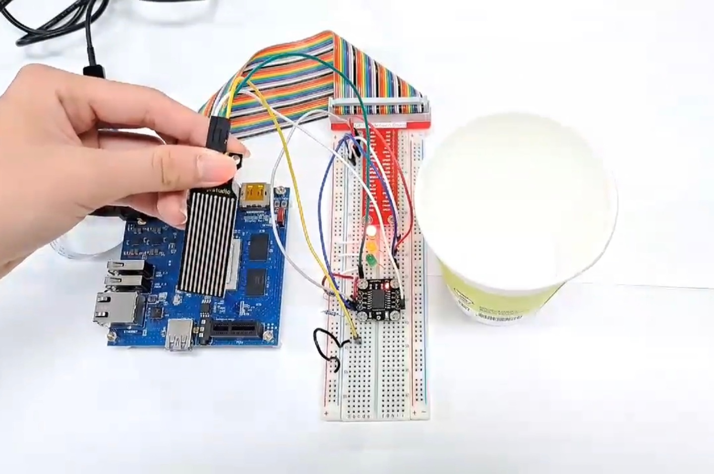
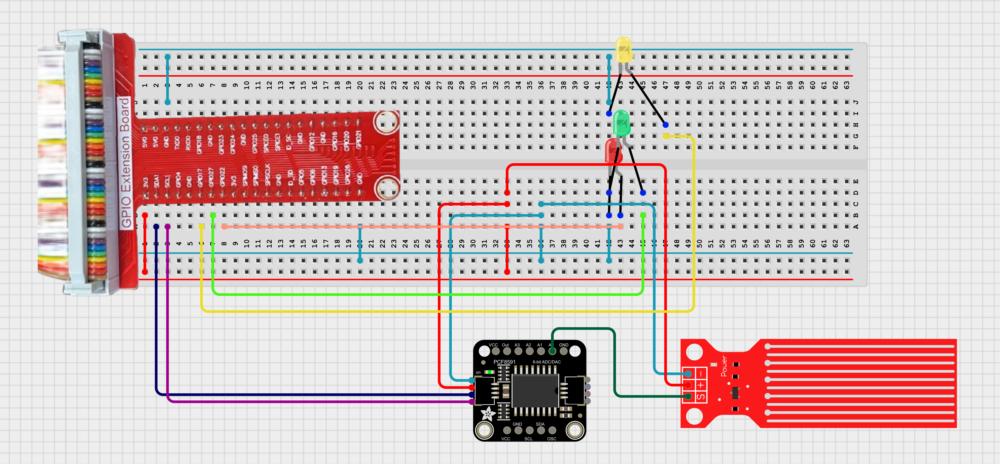

# TOPST D3_ Water level sensor

## Introduction

In this document, we'll explore how to interface a water level sensor with GPIO pins on the D3 board. Water level sensors are essential components in various applications, allowing us to measure and monitor the level of water in a container and trigger specific actions in response.

<br>

**1. Water Level Detection**<br>
: To detect water levels using the D3 board and a water level sensor, and to respond to the detected levels by performing various actions such as turning on a pump or sending a notification.
    
There are two ways to write code. <BR>
The **first method** is to write and operate the GPIO code directly **without using libraries**. Use the first method to verify the fundamental operation of the board.<bR> 
The **second method** is to **use libraries**. Libraries allow you to operate components more conveniently<br>

Additionally,<Br>
You can find Library at 00_Base_Library Documentary. When you want to learn more deeply reference them.


## Materials
|DEVICE|MODEL NAME|NUM|
|:------:|:------:|:------:|
|TOPST BOARD|D3|1|
|LED|RED, YELLOW, GREEN|3|
|GPIO Extention Board||1|
|WIRE|||
|Water level sensor||1|
|PCF8591||1|


## Circuit Picture
<p align="center">

</p>
<p align="center">

</p>

### D3 BOARD

|PIN Number|PIN Name|Opponent's PIN|Connect Device|
|:------:|:------:|:------:|------|
|3|GPIO82|SDA|PCF8591|
|5|GPIO81|SCL|PCF8591|
|11|GPIO84|+|YELLOW LED|
|13|GPIO85|+|GREEN LED|
|15|GPIO86|+|RED LED|

## GPIO Pin Map
<br>

<p align="center">


<BR>

## 1. Code _ Water level sensor with LED
### Code without using libraries

```python
import os
import time
import smbus

bus = smbus.SMBus(1)
address = 0x48

LED1_PIN = 84  # 물이 없는 상태에서 켜지는 LED
LED2_PIN = 85  # 물이 중간 정도일 때 켜지는 LED
LED3_PIN = 86  # 물이 꽉 찼을 때 켜지는 LED

GPIO_BASE_PATH = "/sys/class/gpio"
GPIO_EXPORT_PATH = os.path.join(GPIO_BASE_PATH, "export")
GPIO_UNEXPORT_PATH = os.path.join(GPIO_BASE_PATH, "unexport")

# GPIO 핀 제어 함수
def gpio_export(pin):
    """GPIO 핀을 활성화합니다."""
    if not os.path.exists(os.path.join(GPIO_BASE_PATH, f"gpio{pin}")):
        with open(GPIO_EXPORT_PATH, "w") as f:
            f.write(str(pin))

def gpio_unexport(pin):
    """GPIO 핀을 비활성화합니다."""
    if os.path.exists(os.path.join(GPIO_BASE_PATH, f"gpio{pin}")):
        with open(GPIO_UNEXPORT_PATH, "w") as f:
            f.write(str(pin))

def gpio_direction(pin, direction):
    """GPIO 핀의 방향을 설정합니다."""
    direction_path = os.path.join(GPIO_BASE_PATH, f"gpio{pin}", "direction")
    with open(direction_path, "w") as f:
        f.write(direction)

def gpio_write(pin, value):
    """GPIO 핀의 값을 설정합니다."""
    value_path = os.path.join(GPIO_BASE_PATH, f"gpio{pin}", "value")
    with open(value_path, "w") as f:
        f.write(str(value))

def read_pcf8591(channel, retries=5):
    """PCF8591에서 아날로그 값을 읽어옵니다."""
    if channel < 0 or channel > 3:
        raise ValueError("Invalid channel: {}".format(channel))
    
    for attempt in range(retries):
        try:
            bus.write_byte(address, 0x40 | channel)
            value = bus.read_byte(address)
            return value
        except IOError as e:
            print(f"Attempt {attempt + 1} failed with error: {e}")
            time.sleep(0.1)
    raise IOError("Failed to communicate with PCF8591 after multiple attempts")
```


The GPIO Initialization Functions are **essential functions** that must always be included beforehand. <br>
***If you want to use these more conveniently, please use the distributed library.***
<br>
<br>


- Function to turn Water level sensor
```python
def control_leds(value):
    if 20 < value < 65:  # 낮은 수위
        gpio_write(LED1_PIN, 1)
        gpio_write(LED2_PIN, 0)
        gpio_write(LED3_PIN, 0)
    elif 65 < value < 170:  # 높은 수위
        gpio_write(LED1_PIN, 0)
        gpio_write(LED2_PIN, 1)
        gpio_write(LED3_PIN, 0)
    else: # 물에 닿지 않았을 때
        gpio_write(LED1_PIN, 0)
        gpio_write(LED2_PIN, 0)
        gpio_write(LED3_PIN, 1)

# GPIO 초기화
gpio_export(LED1_PIN)
gpio_export(LED2_PIN)
gpio_export(LED3_PIN)

gpio_direction(LED1_PIN, "out")
gpio_direction(LED2_PIN, "out")
gpio_direction(LED3_PIN, "out")
```
- Main code starts here
```python
try:
    while True:
        try:
            value = read_pcf8591(0)  # 센서 값 읽기
            print("Sensor value: {}".format(value))
            control_leds(value)
        except IOError as e:
            print("I2C communication error: ", e)
        time.sleep(1)
except KeyboardInterrupt:
    pass
finally:
    gpio_unexport(LED1_PIN)
    gpio_unexport(LED2_PIN)
    gpio_unexport(LED3_PIN)
    bus.close()
```
<br>

**To run this script, you would use:**

```python
python3 script_name
```
For example:
```python
python3 water_sensor.py
```
<BR>

### Code When using libraries
- Library
```python
from .. import I2C_Library as i2c

# set i2c bus and device address (default address : 0x48)
def open_device(bus, addr = 0x48):
    fd = i2c.i2c_open(bus)
    i2c.i2c_set_slave(fd, addr)
    return fd

# output : enable output, input : method of get value, auto_increment, channel : analog register number (0~3)
# get control byte for control pcf8591 device
def get_control_byte(output, input, auto_increment, channel):
    control_byte = str(0)
    control_byte = control_byte + str(output)
    control_byte = control_byte + int_to_binary_string(input)
    control_byte = control_byte + str(0)
    control_byte = control_byte + str(auto_increment)
    control_byte = control_byte + int_to_binary_string(channel)

    print(control_byte)
    return int(control_byte, 2)

# make int to binary string
def int_to_binary_string(bit_value):
    binary_string = bin(bit_value)[2:]
    if len(binary_string) == 1:
        binary_string = '0' + binary_string
    return binary_string

# transfer control byte
def write_device(fd, control_byte):
    i2c.i2c_write(fd, control_byte)

# get value from pcf8591
def read_device(fd, control_byte):
    i2c.i2c_write(fd, control_byte)
    while(True):
        data = i2c.i2c_read(fd, 2)[1]
        if(data!= 128):
            break
    return data

# quit i2c communication after using device
def quit_device(fd):
    i2c.i2c_quit(fd)
```
- Controller
```python
from ..Library.Module import PCF8591_Library as pcf
import time

bus = 1
addr = 0x48
channel = 00
auto_increment = 0
input = 0
output = 1

if __name__ == "__main__":
    fd = pcf.open_device(bus, addr) # regist pcf8591 device
    control_byte = pcf.get_control_byte(output, input, auto_increment, channel) # get control byte
    pcf.write_device(fd, control_byte) # transfer control byte
    for i in range(10):
        print(pcf.read_device(fd, control_byte)) # read analog data
        time.sleep(0.05)
    pcf.quit_device(fd) # unregist pcf8591 device
```
**To run this script, you would use:**

Be sure to download script file at **00_Base_Library**.

Location of scripts can cause error.

When you write script yourself, modify **import path**.

```
cd {parent directory path which can include library and controller both}
python3 -m {controller script path}
```

For example:
```
cd TOPST
python3 -m TOPST.Controller.PCF8591_Controller
```
<br>

## Result Mov
- Water Level sensor<br>


