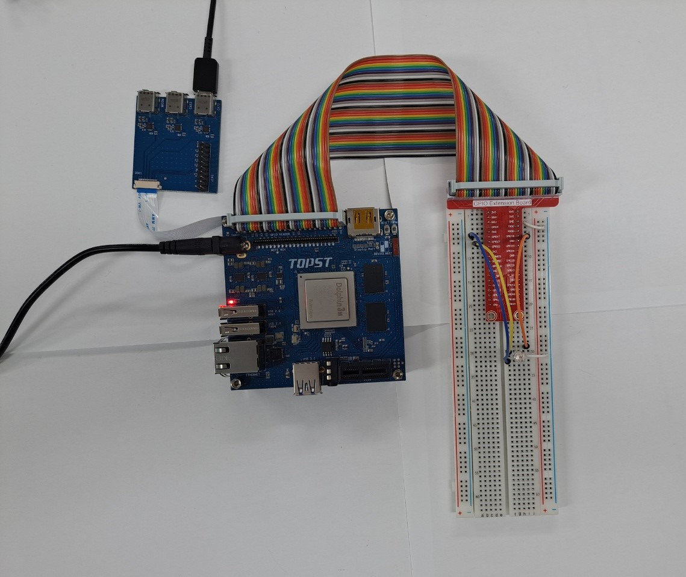
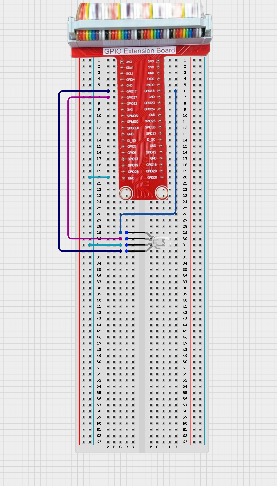

# TOPST D3_ RGB LED Controller

## Introduction

In this document, we'll control an RGB LED with GPIO pins on the D3 board. The RGB LED allows us to produce a wide range of colors by adjusting the intensity of its red, green, and blue components.
<br>

**1. LED ON/OFF**<br>
: To control the state of the RGB LED (turning it ON and OFF) using the D3 board, and to emit various colors by mixing the RGB components.
    
There are two ways to write code. <BR>
The **first method** is to write and operate the GPIO code directly **without using libraries**. Use the first method to verify the fundamental operation of the board.<bR> 
The **second method** is to **use libraries**. Libraries allow you to operate components more conveniently

Additionally,
You can find Library at 00_Base_Library Documentary. When you want to learn more deeply reference them.


## Materials
|DEVICE|MODEL NAME|NUM|
|:------:|:------:|:------:|
|TOPST BOARD|D3|1|
|RGB LED||1|
|GPIO Extention Board||1|
|WIRE|


## Circuit Picture
<p align="center">


<p align="center">

</p>

### D3 BOARD
**Connect each pin of the RGB LED to the respective GPIO pins on the D3 board:**

|PIN Number|PIN Name|Opponent's PIN|Connect Device|
|:------:|:------:|:------:|------|
|11|GPIO84|+|YELLOW LED|
|12|GPIO89|+|GREEN LED|
|13|GPIO85|+|RED LED|
|39|GND|-|RGB LED|


## GPIO Pin Map
<br>

<p align="center">


<BR>

## 1. Code _ RGB LED ON/OFF
### Code without using libraries

```python
import sys
import os
import time

# Define paths for GPIO operations
GPIO_EXPORT_PATH = "/sys/class/gpio/export"
GPIO_UNEXPORT_PATH = '/sys/class/gpio/unexport'
GPIO_DIRECTION_PATH_TEMPLATE = '/sys/class/gpio/gpio{}/direction'
GPIO_VALUE_PATH_TEMPLATE = '/sys/class/gpio/gpio{}/value'
GPIO_BASE_PATH_TEMPLATE = '/sys/class/gpio/gpio{}'

# Check if the GPIO is already exported by verifying the base path
def is_gpio_exported(gpio_number):
    gpio_base_path = GPIO_BASE_PATH_TEMPLATE.format(gpio_number)
    return os.path.exists(gpio_base_path)

# Export the GPIO if the base path does not exist
def export_gpio(gpio_number):
    if not is_gpio_exported(gpio_number):
        try:
            with open(GPIO_EXPORT_PATH, 'w') as export_file:
                export_file.write(str(gpio_number))
        except IOError as e:
            print(f"Error exporting GPIO: {e}")
            sys.exit(1)

# Unexport the GPIO
def unexport_gpio(gpio_number):
    try:
        with open(GPIO_UNEXPORT_PATH, 'w') as unexport_file:
            unexport_file.write(str(gpio_number))
    except IOError as e:
        print(f"Error unexporting GPIO: {e}")
        sys.exit(1)

# Set the direction of the GPIO (e.g., 'in' or 'out')
def set_gpio_direction(gpio_number, direction):
    gpio_direction_path = GPIO_DIRECTION_PATH_TEMPLATE.format(gpio_number)
    try:
        with open(gpio_direction_path, 'w') as direction_file:
            direction_file.write(direction)
    except IOError as e:
        print(f"Error setting GPIO direction: {e}")
        sys.exit(1)

# Set the value of the GPIO (e.g., 1 or 0)
def set_gpio_value(gpio_number, value):
    gpio_value_path = GPIO_VALUE_PATH_TEMPLATE.format(gpio_number)
    try:
        with open(gpio_value_path, 'w') as value_file:
            value_file.write(str(value))
    except IOError as e:
        print(f"Error setting GPIO value: {e}")
        sys.exit(1)
```


The GPIO Initialization Functions are **essential functions** that must always be included beforehand. <br>
***If you want to use these more conveniently, please use the distributed library.***
<br>
<br>

- Function to turn LED on 
```python
def led_onoff(gpio_number, direction, value):
    export_gpio(gpio_number)
    set_gpio_direction(gpio_number, direction)
    set_gpio_value(gpio_number, value)

# RGB LED function
def set_rgb_led(red_pin, green_pin, blue_pin, red_value, green_value, blue_value):
    led_onoff(red_pin, 'out', red_value)
    led_onoff(green_pin, 'out', green_value)
    led_onoff(blue_pin, 'out', blue_value)
```
- Main code starts here
```python
if __name__ == "__main__":

    RED_PIN = 84
    GREEN_PIN = 85
    BLUE_PIN = 89

    try:
        while True:
            set_rgb_led(RED_PIN, GREEN_PIN, BLUE_PIN, 1, 0, 0)  # red
            time.sleep(1)
            set_rgb_led(RED_PIN, GREEN_PIN, BLUE_PIN, 0, 1, 0)  # green
            time.sleep(1)
            set_rgb_led(RED_PIN, GREEN_PIN, BLUE_PIN, 0, 0, 1)  # blue
            time.sleep(1)
            set_rgb_led(RED_PIN, GREEN_PIN, BLUE_PIN, 1, 1, 0)  # yellow
            time.sleep(1)
            set_rgb_led(RED_PIN, GREEN_PIN, BLUE_PIN, 0, 1, 1)  # bluish green
            time.sleep(1)
            set_rgb_led(RED_PIN, GREEN_PIN, BLUE_PIN, 1, 0, 1)  # magenta
            time.sleep(1)
            set_rgb_led(RED_PIN, GREEN_PIN, BLUE_PIN, 0, 0, 0)  # off
            time.sleep(1)
    except KeyboardInterrupt:
        set_rgb_led(RED_PIN, GREEN_PIN, BLUE_PIN, 0, 0, 0)
        unexport_gpio(RED_PIN)
        unexport_gpio(GREEN_PIN)
        unexport_gpio(BLUE_PIN)

    print("RGB LED Control Finished")
    sys.exit(0)
```
<br>

**To run this script, you would use:**

```python
python3 script_name
```
For example:
```python
python3 RGB_LED.py
```
<BR>

### Code When using libraries
- Library
```python
from .. import GPIO_Library as gpio

# regist RGB_LED
def set_device(rgb_pins):
    for pin in rgb_pins:
        gpio.export(pin)
        gpio.set_direction(pin, 'out')
        gpio.set_value(pin, 0)

# unregist RGB_LED
def quit_device(rgb_pins):
    for pin in rgb_pins:
        gpio.unexport(pin)

# set red, green, blue value
def set_value(rgb_pins, values):
    for i in len(rgb_pins):
        gpio.set_value(rgb_pins[i], values[i])
```
- Controller
```python
from ..Library.Module import RGB_Led_Library as rgb

rgb_pins = [112,113,114] # red, green, blue gpio pin
values = [0,1,1] # green + blue => yellow

if __name__ == "__main__":
    rgb.set_device(rgb_pins) # regist device
    rgb.set_value(rgb_pins, values) # turn on yellow light
    rgb.set_value(rgb_pins, [0,0,0]) # turn off
    rgb.quit_device(rgb_pins) # unregist device
```

**To run this script, you would use:**

Be sure to download script file at **00_Base_Library**.

Location of scripts can cause error.

When you write script yourself, modify **import path**.

```
cd {parent directory path which can include library and controller both}
python3 -m {controller script path}
```

For example:
```
cd TOPST
python3 -m TOPST.Controller.LED_Controller_GPIO
```
<br>

## Result Mov

- RGB LED on/off<br>
