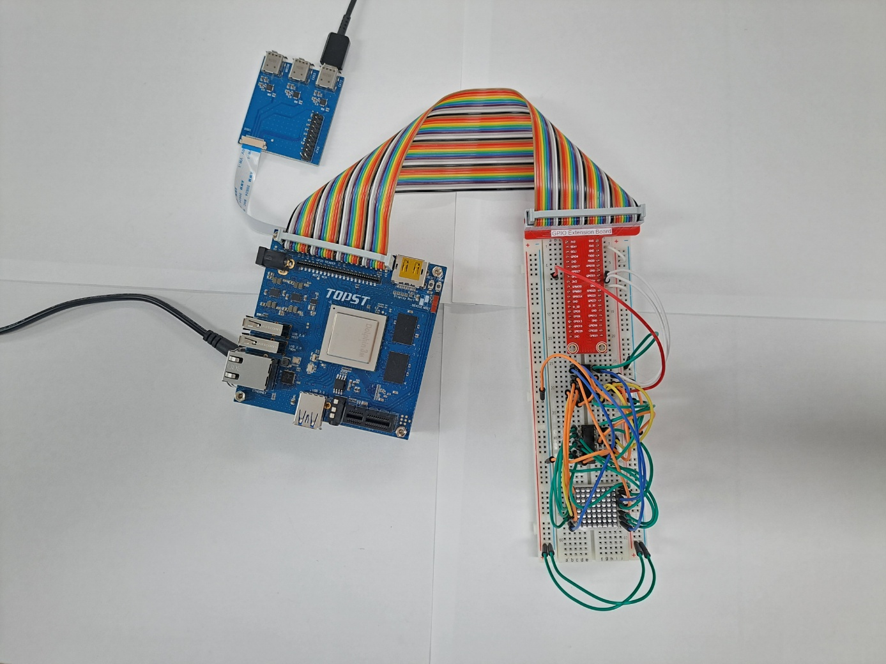
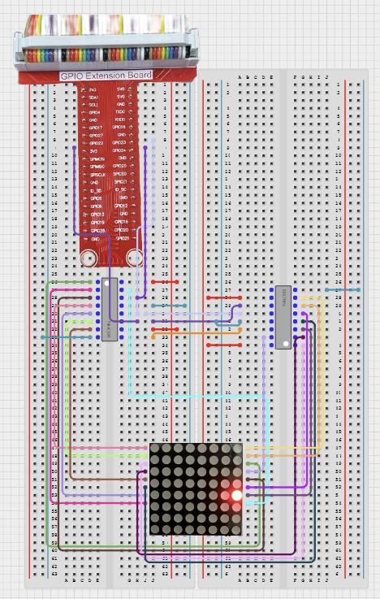

# TOPST D3_ Dot Matrix with 74HC595N

## Introduction

we'll control a dot matrix display using the SPI protocol and shift registers.

**Dot Matrix Initialization** <Br> : Set up the dot matrix display and initialize the necessary configurations using the TOPST D3 board and SN74HC595N shift registers.

**Pattern Display**<br>: Display various patterns on the dot matrix, demonstrating different capabilities and visual effects using the D3 board and SN74HC595N shift registers.
<br>     
The **method** is to **use libraries**. Libraries allow you to operate components more conveniently<br>

Additionally,<Br>
You can find Library at 00_Base_Library Documentary. When you want to learn more deeply reference them.


## Materials
|DEVICE|MODEL NAME|NUM|
|:------:|:------:|:------:|
|TOPST BOARD|D3|1|
|8*8 Dot Matrix||1|
|GPIO Extention Board||1|
|Shift Register|SN74HC595N|2|
|WIRE|


## Circuit Picture
<p align="center">

</p>
<p align="center">

</p>

### D3 BOARD

### SN74HC595 #1
|PIN Number|PIN Name|Opponent's PIN|Connect Device|PIN Number|PIN Name|Opponent's Pin|Connect Device|
|:------:|:------:|:------:|------|:------:|:------:|:------:|------|
|1|Q1|14|DotMatrix|16|VCC|5V|D3 Board|
|2|Q2|8|DotMatrix|15|Q0|9|DotMatrix|
|3|Q3|12|DotMatrix|14|DS|GPIO65|D3 Board|
|4|Q4|1|DotMatrix|13|OE|GND|D3 Board|
|5|Q5|7|DotMatrix|12|ST_CP|GPIO90|D3 Board|
|6|Q6|2|DotMatrix|11|SH_CP|GPIO86|D3 Board|
|7|Q7|5|DotMatrix|10|MR|5V|D3 Board|
|8|GND|GND|D3 Board|9|Q7`|14|SN74HC595 #2|

### SN74HC595 #2
|PIN Number|PIN Name|Opponent's PIN|Connect Device|PIN Number|PIN Name|Opponent's Pin|Connect Device|
|:------:|:------:|:------:|------|:------:|:------:|:------:|------|
|1|Q1|3|DotMatrix|16|VCC|5V|D3 Board|
|2|Q2|4|DotMatrix|15|Q0|13|DotMatrix|
|3|Q3|10|DotMatrix|14|DS|9|SN74HC595 #1|
|4|Q4|6|DotMatrix|13|OE|GND|D3 Board|
|5|Q5|11|DotMatrix|12|ST_CP|GPIO90|D3 Board|
|6|Q6|15|DotMatrix|11|SH_CP|GPIO86|D3 Board|
|7|Q7|16|DotMatrix|10|MR|5V|D3 Board|
|8|GND|GND|D3 Board|9|Q7`| - | - |

<br>
<Br>

---

|PIN Number|PIN Name|Opponent's PIN|Connect Device|PIN Number|PIN Name|Opponent's Pin|Connect Device|
|:------:|:------:|:------:|------|:------:|:------:|:------:|------|
|15|GPIO86|11|SN74HC595 #1, #2|12|GPIO90|5V|SN74HC595 #1, #2|
|18|GPIO65|14|SN74HC595 #1|
---

## GPIO Pin Map
<br>

<p align="center">


<BR>

## 1. Code Dotmatrix with 74HC595N
### Code when using library
- Library
```python
from.. import Soft_SPI_Library as spi
import struct

rows = [
    0xFE,
    0xFD,
    0xFB,
    0xF7,
    0xEF,
    0xDF,
    0xBF,
    0x7F
]

# prepare gpio pins for use device
def set_spi(mosi_pin, sclk_pin, rclk_pin):
    spi.set_soft_spi(0, sclk_pin, mosi_pin, 0, rclk_pin)

# transfer data with combine rows
def transfer_data(data, mosi_pin, sclk_pin, rclk_pin):
    print(f"Debug: sclk_pin = {sclk_pin}")  # sclk_pin 값 확인
    send_data = [] # saving space for packaging data
    i = 0
    for byte in data:
        send_data.append(struct.pack('BB', rows[i], byte)) # package data and rows
        i+=1
    for m in range(len(data)):
        spi.write_data(send_data[m],  mosi_pin, sclk_pin) # write packaging data
        print(send_data[m])
        spi.RClock(rclk_pin) # register toggle

# clear gpio pins after using device
def clear_spi(mosi_pin, sclk_pin, rclk_pin):
    spi.clear_soft_spi(0, sclk_pin, mosi_pin, 0, rclk_pin)

```
- Controller
```python
from ..Library.Module import DotMatrix_softSPI_Library as dot
import sys
rclk_pin = 90 # RCLK
sclk_pin = 86 # SRCLK
mosi_pin = 65 # MOSI

data = [
    [
        0b10000001,
        0b10000001,
        0b10000001,
        0b10000001,
        0b10011001,
        0b10100101,
        0b10100101,
        0b01000010,
    ],
    [
        0b11000011,
        0b11000011,
        0b11000011,
        0b11111111,
        0b11111111,
        0b11000011,
        0b11000011,
        0b11000011,
    ],
    [
        0b00011000,
        0b00111100,
        0b01100110,
        0b11000011,
        0b11111111,
        0b11000011,
        0b11000011,
        0b11000011,
    ],
    [
        0b11111111,
        0b11111111,
        0b00011000,
        0b00011000,
        0b00011000,
        0b00011000,
        0b00011000,
        0b00011000,
    ],
    [
        0b11000011,
        0b11000011,
        0b11000011,
        0b01100110,
        0b00111100,
        0b00011000,
        0b00011000,
        0b00011000,
    ],
    [
        0b00011000,
        0b00111100,
        0b01100110,
        0b11000011,
        0b11000011,
        0b01100110,
        0b00111100,
        0b00011000,
    ],
    [
        0b11000011,
        0b11000011,
        0b11000011,
        0b11000011,
        0b11000011,
        0b11000011,
        0b01100110,
        0b00111100
    ],
    [
        0b10000001,
        0b10000001,
        0b10000001,
        0b10000001,
        0b10011001,
        0b10100101,
        0b10100101,
        0b01000010,
    ],
    [
        0b00011000,
        0b00111100,
        0b01100110,
        0b11000011,
        0b11111111,
        0b11000011,
        0b11000011,
        0b11000011,
    ],
    [
        0b11000011,
        0b11100011,
        0b11110011,
        0b11011011,
        0b10011011,
        0b11001111,
        0b11000111,
        0b11000011,
    ],
    [
        0b11000011,
        0b11100011,
        0b11110011,
        0b11011011,
        0b10011011,
        0b11001111,
        0b11000111,
        0b11000011,
    ],
    [
        0b00011000,
        0b00111100,
        0b01100110,
        0b11000011,
        0b11111111,
        0b11000011,
        0b11000011,
        0b11000011,
    ],
    [
        0b11110000,
        0b10011100,
        0b11000111,
        0b11000011,
        0b11000011,
        0b11000111,
        0b11011100,
        0b11110000,
    ],
    [
        0b00011000,
        0b00111100,
        0b01100110,
        0b11000011,
        0b11000011,
        0b01100110,
        0b00111100,
        0b00011000,
    ],
]

if __name__ == "__main__":
    dot.set_spi(mosi_pin, sclk_pin, rclk_pin) # regist 74hc595n for soft spi
    for i in range(len(data)):
        dot.transfer_data(data[i], mosi_pin,sclk_pin, rclk_pin) # transfer data
```
**To run this script, you would use:**

Be sure to download script file at **00_Base_Library**.

Location of scripts can cause error.

When you write script yourself, modify **import path**.

```
cd {parent directory path which can include library and controller both}
python3 -m {controller script path}
```

For example:
```
cd TOPST
python3 -m TOPST.Controller.DotMatrix_Controller_Softspi
```
<br>

## Result Mov

- Dotmatrix text<br>


