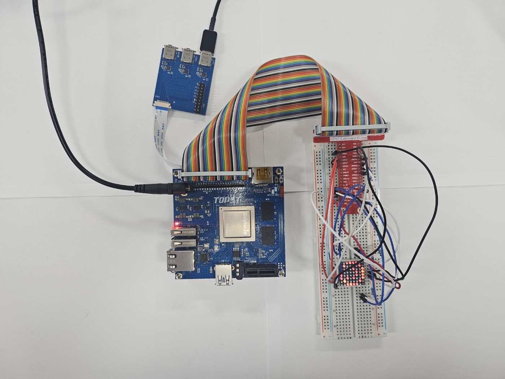
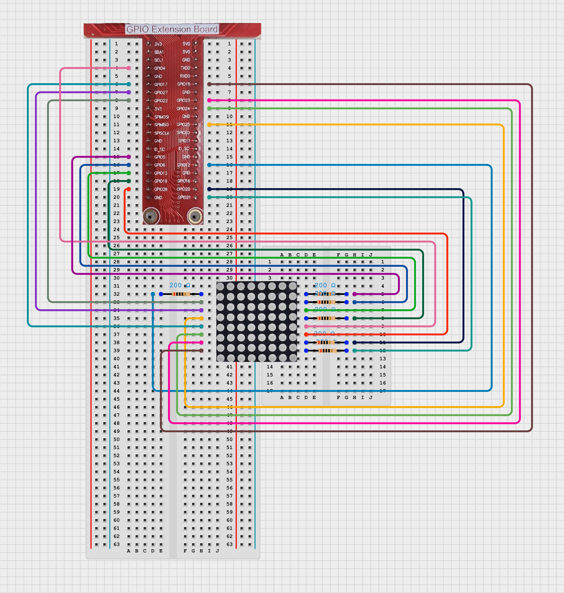

# TOPST D3_ Dot Matrix Controller

## Introduction

In this document, we'll control Dot Matrix with gpio pin.
<br>
<br>
**Dot Matrix**
    : To control the state of Dot Matrix (Display smile, numbers, alphabets) using the D3 board.
    
There are two ways to write code. <BR>
The **first method** is to write and operate the GPIO code directly **without using libraries**. Use the first method to verify the fundamental operation of the board.<bR> 
The **second method** is to **use libraries**. Libraries allow you to operate components more conveniently<Br>

Additionally,<br>
You can find Library at 00_Base_Library Documentary. When you want to learn more deeply reference them.


## Materials
|DEVICE|MODEL NAME|NUM|
|:------:|:------:|:------:|
|TOPST BOARD|D3|1|
|Dot Matrix||1|
|GPIO Extention Board||1|
|Resistance|220OHM|6|
|WIRE|||


## Circuit Picture
<p align="center">

</p>
<p align="center">

</p>


### D3 BOARD

|PIN Number|PIN Name|Opponent's PIN|Connect Device|PIN Number|PIN Name|Opponent's PIN|Connect Device|
|:------:|:------:|:------:|------|:------:|:------:|:------:|------|
|18|GPIO65|14|Dot matrix|31|GPIO113|7|Dot matrix|
|22|GPIO66|12|Dot matrix|33|GPIO114|6|Dot matrix|
|7|GPIO83|4|Dot matrix|32|GPIO115|9|Dot matrix|
|11|GPIO84|13|Dot matrix|37|GPIO117|3|Dot matrix|
|13|GPIO85|11|Dot matrix|40|GPIO118|1|Dot matrix|
|15|GPIO86|10|Dot matrix|38|GPIO120|2|Dot matrix|
|12|GPIO89|16|Dot matrix|35|GPIO121|5|Dot matrix|
|16|GPIO90|15|Dot matrix|29|GPIO112|8|Dot matrix|


## GPIO Pin Map
<br>

<p align="center">


<BR>

## 1. Code _ Smile | Numbers | Alphabets
### Code When using Libraries
```python
import sys
import os
import time

import dotsArr

GPIO_EXPORT_PATH = "/sys/class/gpio/export"
GPIO_UNEXPORT_PATH = '/sys/class/gpio/unexport'
GPIO_DIRECTION_PATH_TEMPLATE = '/sys/class/gpio/gpio{}/direction'
GPIO_VALUE_PATH_TEMPLATE = '/sys/class/gpio/gpio{}/value'
GPIO_BASE_PATH_TEMPLATE = '/sys/class/gpio/gpio{}'


def is_gpio_exported(gpio_number): ##base path -> return T/F
    gpio_base_path = GPIO_BASE_PATH_TEMPLATE.format(gpio_number)
    return os.path.exists(gpio_base_path)

def export_gpio(gpio_number): ##BASE PATH가 존재하지 적어주기
    if not is_gpio_exported(gpio_number):
        try:
            with open(GPIO_EXPORT_PATH, 'w') as export_file:
                export_file.write(str(gpio_number))
        except IOError as e:
            print(f"Error exporting GPIO: {e}")
            sys.exit(1)
            
def unexport_gpio(gpio_number):
    try:
        with open(GPIO_UNEXPORT_PATH , 'w') as unexport_file:
            unexport_file.write(str(gpio_number))
    except IOError as e:
        print(f"Error unexporting GPIO: {e}")
        sys.exit(1)

def set_gpio_direction(gpio_number, direction):
    gpio_direction_path = GPIO_DIRECTION_PATH_TEMPLATE.format(gpio_number)
    try:
        with open(gpio_direction_path, 'w') as direction_file:
            direction_file.write(direction)
    except IOError as e:
        print(f"Error setting GPIO direction: {e}")
        sys.exit(1)

def set_gpio_value(gpio_number, value):
    gpio_value_path = GPIO_VALUE_PATH_TEMPLATE.format(gpio_number)
    try:
        with open(gpio_value_path, 'w') as value_file:
            value_file.write(str(value))
    except IOError as e:
        print(f"Error setting GPIO value: {e}")
        sys.exit(1)

def set_matrix_value(map):
    i = 0
    for r in map:
        set_gpio_value(row[i], 1)
        for c in range(8):
            bit = (r >> 7-c) & 0x01
            if bit == 0: set_gpio_value(col[c], 1)
            else: set_gpio_value(col[c], 0)
        turn_off_all()
        i += 1

def turn_off_all():
    for r in row:
        set_gpio_value(r,0)
    for c in col:
        set_gpio_value(c,1)
```
<br>

#### Function to display 'smile'
```python
# ROW & COL NUM
row = [115,65,112,66,118,113,120,121]
col = [84,117,83,86,114,85,90,89]

def set_matrix_value(map):
    i = 0
    for r in map:
        set_gpio_value(row[i], 1)
        for c in range(8):
            bit = (r >> 7-c) & 0x01
            if bit == 0: set_gpio_value(col[c], 1)
            else: set_gpio_value(col[c], 0)
        turn_off_all()
        i += 1
```
- Main code of "smile" starts here
```python
if sys.argv[1] == "smile":
            while(1):
                set_matrix_value(smileMap)
```
<br>

#### Function to display 'numbers'
```python
# ROW & COL NUM
def set_matrix_value(map):
    i = 0
    for r in map:
        set_gpio_value(row[i], 1)
        for c in range(8):
            bit = (r >> 7-c) & 0x01
            if bit == 0: set_gpio_value(col[c], 1)
            else: set_gpio_value(col[c], 0)
        turn_off_all()
        i += 1
```
- Main code of "numbers" starts here
```python
if sys.argv[1] == "numbers":
    time_1 = time.time() + 1
    for i in range(len(dotsArr.numbers)):
        while(time.time() < time_1):
            set_matrix_value(dotsArr.numbers[i])
        time_1 = time.time() + 1
```
<br>

#### Function to display 'alphabets'
  - Function to display 'alphabets'<br>
  **Although it may not be present in videos, you can also verify the alphabet.**<br>
  **You can check Alphabets image in Images Directory**

```python
def set_matrix_value(map):
    i = 0
    for r in map:
        set_gpio_value(row[i], 1)
        for c in range(8):
            bit = (r >> 7-c) & 0x01
            if bit == 0: set_gpio_value(col[c], 1)
            else: set_gpio_value(col[c], 0)
        turn_off_all()
        i += 1
```
- Main code of "alphabets" starts here
```python
if sys.argv[1] == "alphabets":
    time_1 = time.time() + 1
    for i in range(len(dotsArr.alphabets)):
        while(time.time() < time_1):
            set_matrix_value(dotsArr.alphabets[i])
        time_1 = time.time() + 1
```
<Br>
<Br>

- Main code starts here (ALL)

```python
# ROW & COL NUM
row = [115,65,112,66,118,113,120,121]
col = [84,117,83,86,114,85,90,89]

#display map
smileMap = [
    0b00111100,
    0b01000010,
    0b10100101,
    0b10000001,
    0b10100101,
    0b10011001,
    0b01000010,
    0b00111100,
]

if __name__ == "__main__":

    if len(sys.argv) != 2:
        print(f"Usage: {sys.argv[0]} <value>")
        sys.exit(1)

    for rowN in row:
        export_gpio(rowN)
        set_gpio_direction(rowN, "out")
    for colN in col:
        export_gpio(colN)
        set_gpio_direction(colN, "out")

    try :
        if sys.argv[1] == "smile":
            while(1):
                set_matrix_value(smileMap)
        
        if sys.argv[1] == "numbers":
            time_1 = time.time() + 1
            for i in range(len(dotsArr.numbers)):
                while(time.time() < time_1):
                    set_matrix_value(dotsArr.numbers[i])
                time_1 = time.time() + 1
        
        if sys.argv[1] == "letters":
            time_1 = time.time() + 1
            for i in range(len(dotsArr.letters)):
                while(time.time() < time_1):
                    set_matrix_value(dotsArr.letters[i])
                time_1 = time.time() + 1

    except Exception as e:
        turn_off_all()
    finally:
        for colN in col:
            unexport_gpio(colN)
        for rowN in row:
            unexport_gpio(rowN)

        sys.exit(0)
```

**You can appropriately change the GPIO pin numbers in the code.**

**To run this script, you would use:**

```python
python3 script_name <value>
```
For example:
```python
python3 dotMatrix.py smile
python3 dotMatrix.py numbers
python3 dotMatrix.py alphabets
```

<br>

## Result Mov
- dotMatrix Smile<br>

- dotMatrix Number<br>


