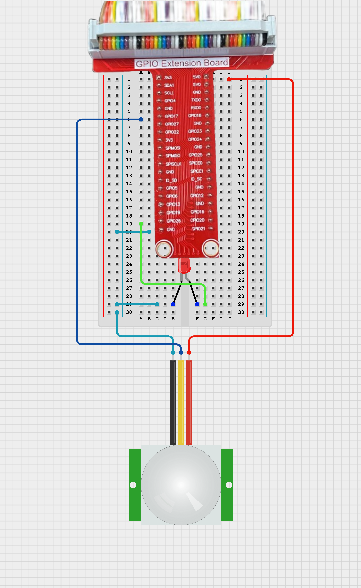

# TOPST D3_ Motion Sensor Controller

## Introduction

In this document, we'll explore how to interface a motion sensor with GPIO pins on the D3 board. Motion sensors are essential components in many applications, allowing us to detect movement and trigger specific actions in response.
<br>
<br>

**1. Motion Detection**<br>
: To detect motion using the D3 board and a motion sensor, and to respond to detected motion by performing various actions such as turning on an LED or sending a notification.
<br>

With these exercises, you will learn the basics of interfacing with a motion sensor, including detecting movement and responding to it programmatically. This will provide a foundation for creating more complex systems that rely on motion detection for automation and security applications.
    
There are two ways to write code. 
The **first method** is to write and operate the GPIO code directly **without using libraries**. Use the first method to verify the fundamental operation of the board. 
The **second method** is to **use libraries**. Libraries allow you to operate components more conveniently

Additionally,
You can find Library at 00_Base_Library Documentary. When you want to learn more deeply reference them.


## Materials
|DEVICE|MODEL NAME|NUM|
|:------:|:------:|:------:|
|TOPST BOARD|D3|1|
|LED|RED|1|
|Motion Sensor||1|
|GPIO Extention Board||1|
|WIRE|||


## Circuit Picture
<p align="center">

</p>
<p align="center">

</p>

### D3 BOARD

|PIN Number|PIN Name|Opponent's PIN|Connect Device|
|:------:|:------:|:------:|------|
|2|5V|VCC|Motion Sensor|
|39|GND|GND|Motion Sensor|
|11|GPIO84|Signal|Moion Sensor|
|37|GPIO117|+|RED LED|
|39|GND|-|RED LED|

The negative (-) side of the resistor is connected to the ground, <br>
and the positive (+) side is connected to the GPIO pin.

## GPIO Pin Map
<br>

<p align="center">


<BR>

## 1. Code _ Motion Sensor
### Code without using libraries

```python
import os
import time

# GPIO path settings
GPIO_BASE_PATH = "/sys/class/gpio"
GPIO_EXPORT_PATH = os.path.join(GPIO_BASE_PATH, "export")
GPIO_UNEXPORT_PATH = os.path.join(GPIO_BASE_PATH, "unexport")

# GPIO pin condtrol functions

def gpio_export(pin):
    """Enable the GPIO pin."""
    if not os.path.exists(os.path.join(GPIO_BASE_PATH, f"gpio{pin}")):
        with open(GPIO_EXPORT_PATH, 'w') as f:
            f.write(str(pin))

def gpio_unexport(pin):
    """Enable the GPIO pin."""
    with open(GPIO_UNEXPORT_PATH, 'w') as f:
        f.write(str(pin))

def gpio_set_direction(pin, direction):
    """Sets the direction of the GPIO pin."""
    direction_path = os.path.join(GPIO_BASE_PATH, f"gpio{pin}", "direction")
    with open(direction_path, 'w') as f:
        f.write(direction)

def gpio_write(pin, value):
    """Write the value on the GPIO pin."""
    value_path = os.path.join(GPIO_BASE_PATH, f"gpio{pin}", "value")
    with open(value_path, 'w') as f:
        f.write(str(value))

def gpio_read(pin):
    """Read the value on the GPIO pin."""
    value_path = os.path.join(GPIO_BASE_PATH, f"gpio{pin}", "value")
    with open(value_path, 'r') as f:
        return f.read().strip()
```


The GPIO Initialization Functions are **essential functions** that must always be included beforehand. <br>
***If you want to use these more conveniently, please use the distributed library.***
<br>
<br>


```python
def read_pir_sensor(pin, samples=10, interval=0.05):
    """Returns the average by reading the sample multiple times from the PIR sensor."""
    readings = []
    for _ in range(samples):
        readings.append(int(gpio_read(pin)))
        time.sleep(interval)
    return sum(readings) / samples
```
this is function that detect motion. return the average value from PIR sensor

- Main code starts here
```python
# pin number setting (BCM) mode
PIR_SENSOR_PIN = 86  # PIR sensor
LED_PIN = 84         # LED 

# GPIO pin activate / setting
gpio_export(PIR_SENSOR_PIN)
gpio_export(LED_PIN)
gpio_set_direction(PIR_SENSOR_PIN, "in")
gpio_set_direction(LED_PIN, "out")

try:
    while True:
        pir_value = read_pir_sensor(PIR_SENSOR_PIN)
        if pir_value >= 0.5:  # If the mean value is greater than 0.5, it is determined as motion detection
            gpio_write(LED_PIN, 1)  # LED ON
            print("Motion detected!")
        else:
            gpio_write(LED_PIN, 0)  # LED OFF
            print("Motion NOT detected!")
        time.sleep(0.5)  # Periodic delay (recurring cycle adjustable)
except KeyboardInterrupt:
    print("Program terminated")
finally:
    gpio_unexport(PIR_SENSOR_PIN)
    gpio_unexport(LED_PIN)
```
<br>

**To run this script, you would use:**

```python
python3 script_name 
```
For example:
```python
python3 motion_sensor.py
```

## Code When using libraries
- Library
```python
from .. import GPIO_Library as gpio

# regist device gpio pin
def set_device(gpio_pin):
    gpio.export(gpio_pin)
    gpio.set_direction(gpio_pin, 'in')

# get data from gpio_pin
def read_data(gpio_pin):
    return gpio.get_value(gpio_pin)

# unregist device gpio pin
def quit_device(gpio_pin):
    gpio.unexport(gpio_pin)
```
- Controller
```python
from ..Library.Module import PIR_Sensor_Library as pir

gpio_pin = 86
cnt = 0

if __name__ == "__main__":
    pir.set_device(gpio_pin) # regist device
    while(cnt < 10000): 
        print(pir.read_data(gpio_pin)) # print read data
        cnt += 1
    pir.quit_device(gpio_pin) # unregist device
```
**To run this script, you would use:**

Be sure to download script file at **00_Base_Library**.

Location of scripts can cause error.

When you write script yourself, modify **import path**.

```
cd {parent directory path which can include library and controller both}
python3 -m {controller script path}
```

For example:
```
cd TOPST
python3 -m TOPST.Controller.PIR_Sensor_Controller
```
<br>

## Result Mov


- Motion Sensor<br>

