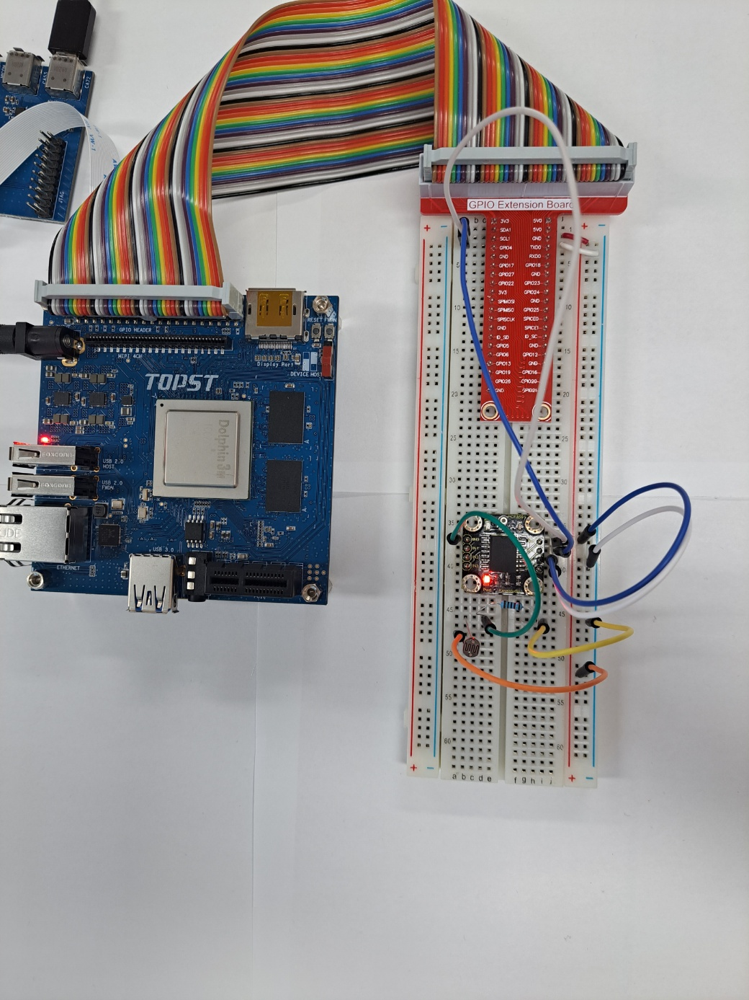
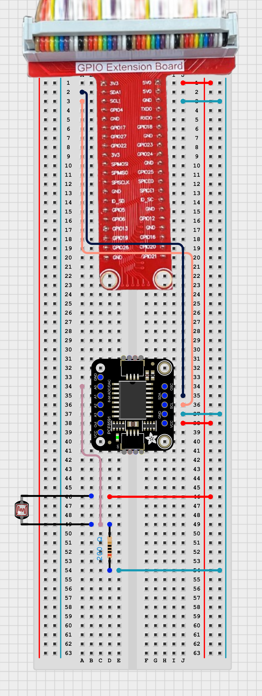

# TOPST D3_ Photoresistor_Controller with PCF8591

## Introduction

PCF8591 is kind of Analog/Digital Converter. This device is use for master device which didn't have analog pin. PCF8951 use I2C interface to transfer data each other. PCF8951 has 4 input channel. <br> Use various sensor with this device.
<br>
<br>

**1. Detect Light**
    : To detect Light using photoresistor and D3 board
<br>

The **method** is to **use libraries**. Libraries allow you to operate components more conveniently<br>

Additionally,<Br>
You can find Library at 00_Base_Library Documentary. When you want to learn more deeply reference them.

## Materials
|DEVICE|MODEL NAME|NUM|
|:------:|:------:|:------:|
|TOPST BOARD|D3|1|
|PCF8591||1|
|Photoresistor||1|
|GPIO Extention Board||1|
|WIRE|||
|RESISTOR|10KOHM||


## Circuit Picture
<p align="center">

</p>
<p align="center">

</p>

### D3 BOARD

|PIN Number|PIN Name|Opponent's PIN|Connect Device|
|:------:|:------:|:------:|------|
|2|5V0|VCC|PCF8591|
|3|GPIO82|SDA|PCF8591|
|5|GPIO81|SCL|PCF8591|
|6|GND|GND|PCF8591|

### Photoresistor

|PIN Number|PIN Name|Opponent's PIN|Connect Device|
|:------:|:------:|:------:|------|
||Photoresistor|VCC|D3 BOARD|
||Photoresistor|GND|D3 BOARD|
||Photoresistor|IN0|PCF8591|

The negative (-) side of the resistor is connected to the ground, <br>
and the positive (+) side is connected to the GPIO pin.

## GPIO Pin Map
<br>

<p align="center">


## 1. Code _ Photoresister with PCF8591
### Code when using libraries
- Library
```python
from .. import I2C_Library as i2c

# set i2c bus and device address (default address : 0x48)
def open_device(bus, addr = 0x48):
    fd = i2c.i2c_open(bus)
    i2c.i2c_set_slave(fd, addr)
    return fd

# output : enable output, input : method of get value, auto_increment, channel : analog register number (0~3)
# get control byte for control pcf8591 device
def get_control_byte(output, input, auto_increment, channel):
    control_byte = str(0)
    control_byte = control_byte + str(output)
    control_byte = control_byte + int_to_binary_string(input)
    control_byte = control_byte + str(0)
    control_byte = control_byte + str(auto_increment)
    control_byte = control_byte + int_to_binary_string(channel)

    print(control_byte)
    return int(control_byte, 2)

# make int to binary string
def int_to_binary_string(bit_value):
    binary_string = bin(bit_value)[2:]
    if len(binary_string) == 1:
        binary_string = '0' + binary_string
    return binary_string

# transfer control byte
def write_device(fd, control_byte):
    i2c.i2c_write(fd, control_byte)

# get value from pcf8591
def read_device(fd, control_byte):
    i2c.i2c_write(fd, control_byte)
    while(True):
        data = i2c.i2c_read(fd, 2)[1]
        if(data!= 128):
            break
    return data

# quit i2c communication after using device
def quit_device(fd):
    i2c.i2c_quit(fd)
```
- Controller
```python
from ..Library.Module import PCF8591_Library as pcf
import time

bus = 1
addr = 0x48
channel = 00
auto_increment = 0
input = 0
output = 1

if __name__ == "__main__":
    fd = pcf.open_device(bus, addr) # regist pcf8591 device
    control_byte = pcf.get_control_byte(output, input, auto_increment, channel) # get control byte
    pcf.write_device(fd, control_byte) # transfer control byte
    for i in range(10):
        print(pcf.read_device(fd, control_byte)) # read analog data
        time.sleep(0.05)
    pcf.quit_device(fd) # unregist pcf8591 device
```
**To run this script, you would use:**

Be sure to download script file at **00_Base_Library**.

Location of scripts can cause error.

When you write script yourself, modify **import path**.

```
cd {parent directory path which can include library and controller both}
python3 -m {controller script path}
```

For example:
```
cd TOPST
python3 -m TOPST.Controller.PCF8591_Controller
```
<br>

## Result Mov

- Photoresistor with PCF8591<br>

