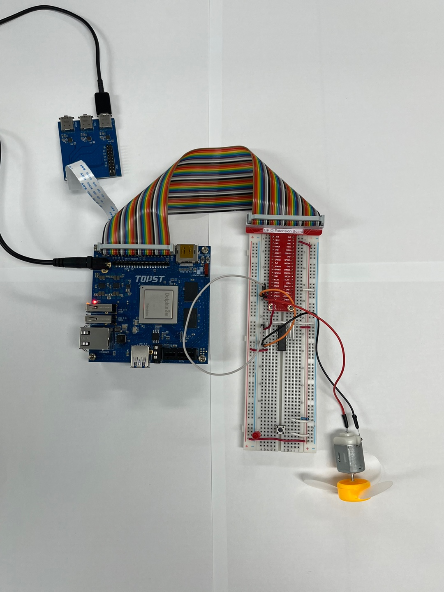

# TOPST D3_ DC Motor Controller

## Introduction

In this document, we'll control a DC motor using GPIO pins and the L293D motor driver.
<br>
<br>
**1. DC Motor Forward/Reverse/Stop**
: To control the state of a DC motor (forward rotation, reverse rotation, and stop) using the D3 board and the L293D motor driver.
<br>

**2. Button-Activated Motor**
: To make the DC motor run when a button is pressed, using the D3 board and the L293D motor driver.
<br>

There are two ways to write code. 
The **first method** is to write and operate the GPIO code directly **without using libraries**. Use the first method to verify the fundamental operation of the board. 
The **second method** is to **use libraries**. Libraries allow you to operate components more conveniently

Additionally,
You can find Library at 00_Base_Library Documentary. When you want to learn more deeply reference them.


## Materials
|DEVICE|MODEL NAME|NUM|
|:------:|:------:|:------:|
|TOPST BOARD|D3|1|
|DC Motor||1|
|BUTTON||1|
|GPIO Extention Board||1|
|WIRE|||
|RESISTOR|220OHM||


## Circuit Picture
- WITHOUT BUTTON
<p align="center">

</p>
<p align="center">

</p>

### D3 BOARD

|PIN Number|PIN Name|Opponent's PIN|Connect Device|PIN Number|PIN Name|Opponent's PIN|Connect Device|
|:------:|:------:|:------:|------|:------:|:------:|:------:|------|
|33|GPIO114|1|L293D|2|5V|8|L293D|
|35|GPIO121|2|L293D|34|GND|12|L293D|
|34|GND|4|L293D|34|GND|13|L293D|
|34|GND|5|L293D|2|5V|16|L293D|
|37|GPIO117|7|L293D|


### DC Motor

|PIN Number|PIN Name|Opponent's PIN|Connect Device|
|:------:|:------:|:------:|------|
|+|DC MOTOR|3|L293D|
|-|DC MOTOR|6|L293D|


## Circuit Picture
- WITH BUTTON
<p align="center">

</p>
<p align="center">

</p>

### D3 BOARD

|PIN Number|PIN Name|Opponent's PIN|Connect Device|PIN Number|PIN Name|Opponent's PIN|Connect Device|
|:------:|:------:|:------:|------|:------:|:------:|:------:|------|
|33|GPIO114|1|L293D|2|5V|8|L293D|
|35|GPIO121|2|L293D|34|GND|12|L293D|
|34|GND|4|L293D|34|GND|13|L293D|
|34|GND|5|L293D|2|5V|16|L293D|
|37|GPIO117|7|L293D|16|GPIO90|2|BUTTON|
|34|GND|2|BUTTON|2|5V|1|BUTTON|
|12|GPIO89|-|RED LED|2|5V|+|RED LED|


### DC Motor

|PIN Number|PIN Name|Opponent's PIN|Connect Device|
|:------:|:------:|:------:|------|
|+|DC MOTOR|3|L293D|
|-|DC MOTOR|6|L293D|

The negative (-) side of the resistor is connected to the ground, <br>
and the positive (+) side is connected to the GPIO pin.

## GPIO Pin Map
<br>

<p align="center">


<BR>

## 1. Code_ Without button
### Code without using libraries

```python
import sys
import os
import time
import signal

# Define paths for GPIO operations
GPIO_EXPORT_PATH = "/sys/class/gpio/export"
GPIO_UNEXPORT_PATH = '/sys/class/gpio/unexport'
GPIO_DIRECTION_PATH_TEMPLATE = '/sys/class/gpio/gpio{}/direction'
GPIO_VALUE_PATH_TEMPLATE = '/sys/class/gpio/gpio{}/value'
GPIO_BASE_PATH_TEMPLATE = '/sys/class/gpio/gpio{}'

# Check if the GPIO is already exported by verifying the base path
def is_gpio_exported(gpio_number):
    gpio_base_path = GPIO_BASE_PATH_TEMPLATE.format(gpio_number)
    return os.path.exists(gpio_base_path)

# Export the GPIO if the base path does not exist
def export_gpio(gpio_number):
    if not is_gpio_exported(gpio_number):
        try:
            with open(GPIO_EXPORT_PATH, 'w') as export_file:
                export_file.write(str(gpio_number))
        except IOError as e:
            print(f"Error exporting GPIO: {e}")
            sys.exit(1)

# Unexport the GPIO
def unexport_gpio(gpio_number):
    if is_gpio_exported(gpio_number):
        try:
            with open(GPIO_UNEXPORT_PATH, 'w') as unexport_file:
                unexport_file.write(str(gpio_number))
        except IOError as e:
            print(f"Error unexporting GPIO: {e}")
            sys.exit(1)

# Set the direction of the GPIO (e.g., 'in' or 'out')
def set_gpio_direction(gpio_number, direction):
    gpio_direction_path = GPIO_DIRECTION_PATH_TEMPLATE.format(gpio_number)
    try:
        with open(gpio_direction_path, 'w') as direction_file:
            direction_file.write(direction)
    except IOError as e:
        print(f"Error setting GPIO direction: {e}")
        sys.exit(1)

# Set the value of the GPIO (e.g., 1 or 0)
def set_gpio_value(gpio_number, value):
    gpio_value_path = GPIO_VALUE_PATH_TEMPLATE.format(gpio_number)
    try:
        with open(gpio_value_path, 'w') as value_file:
            value_file.write(str(value))
    except IOError as e:
        print(f"Error setting GPIO value: {e}")
        sys.exit(1)

# GPIO pin reset
def initialize_gpio(gpio_number, direction):
    unexport_gpio(gpio_number)
    export_gpio(gpio_number)
    set_gpio_direction(gpio_number, direction)
```


The GPIO Initialization Functions are **essential functions** that must always be included beforehand. <br>
***If you want to use these more conveniently, please use the distributed library.***
<br>
<br>

- funtion to control motor
```python
# motor control function
def motor_control(in1, in2, enable, direction, pwm):
    if direction == "forward":
        set_gpio_value(in1, 1)
        set_gpio_value(in2, 0)
    elif direction == "backward":
        set_gpio_value(in1, 0)
        set_gpio_value(in2, 1)
    else:  # stop
        set_gpio_value(in1, 0)
        set_gpio_value(in2, 0)
    
    set_gpio_value(enable, pwm)
```
- Main code starts here
```python
if __name__ == "__main__":
    IN1 = 121
    IN2 = 117
    ENABLE = 114

    # GPIO pin reset
    initialize_gpio(IN1, 'out')
    initialize_gpio(IN2, 'out')
    initialize_gpio(ENABLE, 'out')

    try:
        while True:
            # motor forward (5s)
            motor_control(IN1, IN2, ENABLE, "forward", 1)
            time.sleep(5)
            # stop (2s)
            motor_control(IN1, IN2, ENABLE, "stop", 0)
            time.sleep(2)
            # motor backward (5s)
            motor_control(IN1, IN2, ENABLE, "backward", 1)
            time.sleep(5)
            # motor stop (2s)
            motor_control(IN1, IN2, ENABLE, "stop", 0)
            time.sleep(2)
    except KeyboardInterrupt:
        print("Terminated by Keyboard Interrupt")
        motor_control(IN1, IN2, ENABLE, "stop", 0)
        GPIO.cleanup()
```
<br>

**To run this script, you would use:**

```python
python3 script_name
```
For example:
```python
python3 DC_motor.py
```

## Code When using libraries
- Library
```python
from ..Library.Module import L293D_Library as l293d
import time

in1 = 121
in2 = 117
channel = 2

if __name__ == "__main__":
    # regist device
    l293d.set_device(in1, in2, channel)
    # motor forward (5s)
    l293d.motor_control(in1, in2, "forward", channel)
    time.sleep(5)
    # stop (2s)
    l293d.motor_control(in1, in2, "stop", channel)
    time.sleep(2)
    # motor backward (5s)
    l293d.motor_control(in1, in2, "backward", channel)
    time.sleep(5)
    # motor stop (2s)
    l293d.motor_control(in1, in2, "stop", channel)
    time.sleep(2)
    # unregist device
    l293d.quit_device(in1, in2, channel)
```
- Controller
```python
from .. import GPIO_Library as gpio
from .. import PWM_Library as pwm

# regist gpio pin and pwm channel
def set_device(in1, in2, channel):
    pwm.export(channel)
    pwm.set_enable(0)

    gpio.export(in1)
    gpio.set_direction(in1, 'out')
    gpio.export(in2)
    gpio.set_direction(in2, 'out')

# select motor rotation and turn on
def motor_control(in1, in2, rotation, channel):
    if rotation == "forward":
        gpio.set_value(in1 , 1)
        gpio.set_value(in2 , 0)
    elif rotation == "backward":
        gpio.set_value(in1 , 0)
        gpio.set_value(in2 , 1)
    else :
        gpio.set_value(in1 , 0)
        gpio.set_value(in2 , 0)
    pwm.set_enable(channel, 1)

# setting motor speed
def set_speed(channel, period, cycle):
    pwm.set_period_ns(period)
    pwm.set_cycle_ns(channel, cycle)

# unregist gpio pin and pwm channel
def quit_device(in1, in2, channel):
    gpio.unexport(in1)
    gpio.unexport(in2)
    pwm.unexport(channel)
```
**To run this script, you would use:**

Be sure to download script file at **00_Base_Library**.

Location of scripts can cause error.

When you write script yourself, modify **import path**.

```
cd {parent directory path which can include library and controller both}
python3 -m {controller script path}
```

For example:
```
cd TOPST
python3 -m TOPST.Controller.L293D_Controller
```

## Result Mov
- DC Motor<br>

<br><br><br>
## 2.Code_ with button
### Code without using libraries

```python
import sys
import os
import time
import signal

# Define paths for GPIO operations
GPIO_EXPORT_PATH = "/sys/class/gpio/export"
GPIO_UNEXPORT_PATH = '/sys/class/gpio/unexport'
GPIO_DIRECTION_PATH_TEMPLATE = '/sys/class/gpio/gpio{}/direction'
GPIO_VALUE_PATH_TEMPLATE = '/sys/class/gpio/gpio{}/value'
GPIO_BASE_PATH_TEMPLATE = '/sys/class/gpio/gpio{}'

# Check if the GPIO is already exported by verifying the base path
def is_gpio_exported(gpio_number):
    gpio_base_path = GPIO_BASE_PATH_TEMPLATE.format(gpio_number)
    return os.path.exists(gpio_base_path)

# Export the GPIO if the base path does not exist
def export_gpio(gpio_number):
    if not is_gpio_exported(gpio_number):
        try:
            with open(GPIO_EXPORT_PATH, 'w') as export_file:
                export_file.write(str(gpio_number))
        except IOError as e:
            print(f"Error exporting GPIO: {e}")
            sys.exit(1)

# Unexport the GPIO
def unexport_gpio(gpio_number):
    if is_gpio_exported(gpio_number):
        try:
            with open(GPIO_UNEXPORT_PATH, 'w') as unexport_file:
                unexport_file.write(str(gpio_number))
        except IOError as e:
            print(f"Error unexporting GPIO: {e}")
            sys.exit(1)

# Set the direction of the GPIO (e.g., 'in' or 'out')
def set_gpio_direction(gpio_number, direction):
    gpio_direction_path = GPIO_DIRECTION_PATH_TEMPLATE.format(gpio_number)
    try:
        with open(gpio_direction_path, 'w') as direction_file:
            direction_file.write(direction)
    except IOError as e:
        print(f"Error setting GPIO direction: {e}")
        sys.exit(1)

# Set the value of the GPIO (e.g., 1 or 0)
def set_gpio_value(gpio_number, value):
    gpio_value_path = GPIO_VALUE_PATH_TEMPLATE.format(gpio_number)
    try:
        with open(gpio_value_path, 'w') as value_file:
            value_file.write(str(value))
    except IOError as e:
        print(f"Error setting GPIO value: {e}")
        sys.exit(1)

# Get the value of the GPIO (e.g., 1 or 0)
def get_gpio_value(gpio_number):
    gpio_value_path = GPIO_VALUE_PATH_TEMPLATE.format(gpio_number)
    try:
        with open(gpio_value_path, 'r') as value_file:
            return int(value_file.read().strip())
    except IOError as e:
        print(f"Error getting GPIO value: {e}")
        sys.exit(1)

# GPIO pin reset
def initialize_gpio(gpio_number, direction):
    unexport_gpio(gpio_number)
    export_gpio(gpio_number)
    set_gpio_direction(gpio_number, direction)
```


The GPIO Initialization Functions are **essential functions** that must always be included beforehand. <br>
***If you want to use these more conveniently, please use the distributed library.***
<br>
<br>


- Function to motor control
```python
# motor control function
def motor_control(in1, in2, enable, direction, pwm):
    if direction == "forward":
        set_gpio_value(in1, 1)
        set_gpio_value(in2, 0)
    else:  # stop
        set_gpio_value(in1, 0)
        set_gpio_value(in2, 0)
    
    set_gpio_value(enable, pwm)
```
- Main code starts here
```python
if __name__ == "__main__":


    IN1 = 121
    IN2 = 117
    ENABLE = 114
    BUTTON_PIN = 90
    LED_PIN = 65


    # GPIO pin reset
    initialize_gpio(IN1, 'out')
    initialize_gpio(IN2, 'out')
    initialize_gpio(ENABLE, 'out')
    initialize_gpio(BUTTON_PIN, 'in')
    initialize_gpio(LED_PIN, 'out')

    # initial, led & motor off
    set_gpio_value(LED_PIN, 1)
    motor_control(IN1, IN2, ENABLE, "stop", 0)

    motor_running = False

    try:
        while True:
            button_state = get_gpio_value(BUTTON_PIN)
            if button_state == 1:  # button on
                if not motor_running:
                    # motor forward & LED ON
                    motor_control(IN1, IN2, ENABLE, "forward", 1)
                    set_gpio_value(LED_PIN, 0)
                    motor_running = True
                else:
                    # MOTOR STOP & LED OFF
                    motor_control(IN1, IN2, ENABLE, "stop", 0)
                    set_gpio_value(LED_PIN, 1)
                    motor_running = False
                time.sleep(0.5)  # Debounce delay
            time.sleep(0.1)  # Polling delay
    except KeyboardInterrupt:
        print("Terminated by Keyboard Interrupt")
        motor_control(IN1, IN2, ENABLE, "stop", 0)
        set_gpio_value(LED_PIN, 0)
        for gpio in [IN1, IN2, ENABLE, BUTTON_PIN, LED_PIN]:
            unexport_gpio(gpio)
```
<br>

**To run this script, you would use:**

```python
python3 script_name
```
For example:
```python
python3 DC_motor_onoff.py
```

<br>

## Result Mov
- DC Motor with button<br>

