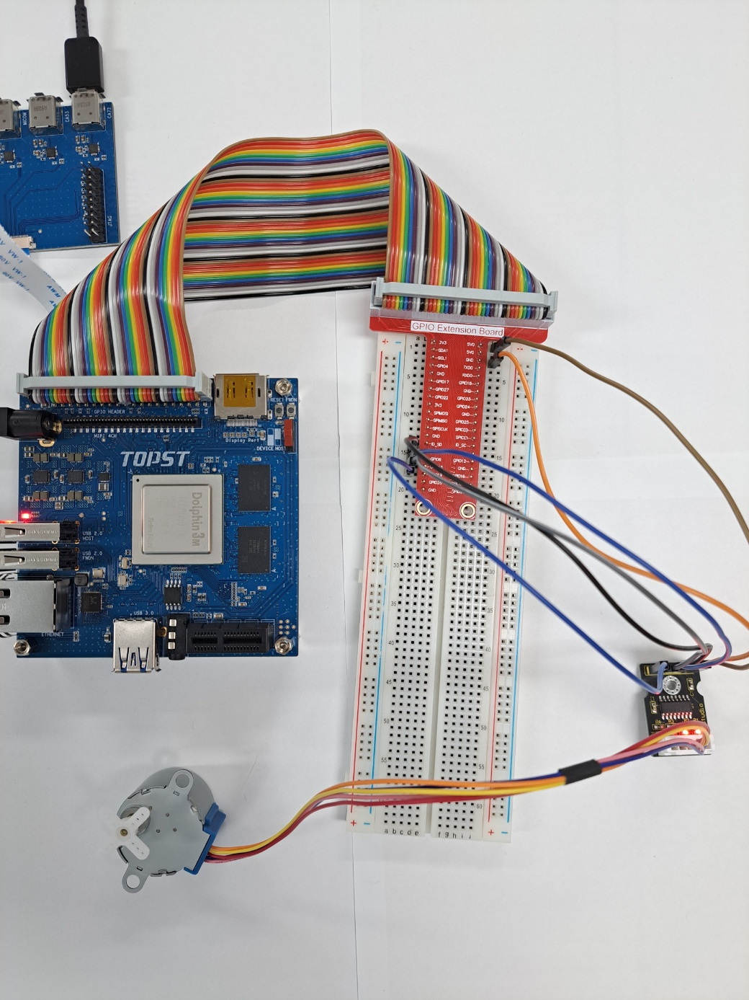
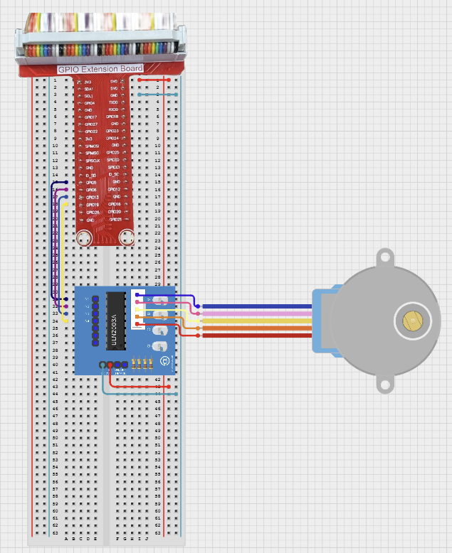

# TOPST D3_ Stepper Motor Controller

## Introduction

Stepper Motor is for elaborate rotation. Use ULN2003 driver for control stepper motor and Driver makes you control easier.
<br>
<br>

**1. Run Stepper Motor**
    : Rotate stepper motor using D3 board
<br>

The **method** is to **use libraries**. Libraries allow you to operate components more conveniently<br>

Additionally,<Br>
You can find Library at 00_Base_Library Documentary. When you want to learn more deeply reference them.


## Materials
|DEVICE|MODEL NAME|NUM|
|:------:|:------:|:------:|
|TOPST BOARD|D3|1|
|Stepper Motor||1|
|Motor Driver|ULN2003|1|
|GPIO Extention Board||1|
|WIRE|||


## Circuit Picture
<p align="center">

</p>
<p align="center">

</p>

### D3 BOARD

|PIN Number|PIN Name|Opponent's PIN|Connect Device|PIN Number|PIN Name|Opponent's PIN|Connect Device|
|:------:|:------:|:------:|------|:------:|:------:|:------:|------|
|2|5V|VCC|ULN2003|6|GND|GND|ULN2003|
|29|GPIO112|IN1|ULN2003|31|GPIO113|IN2|ULN2003|
|33|GPIO114|IN3|ULN2003|35|GPIO0121|IN4|ULN2003|

### Stepper Motor

|PIN Number|PIN Name|Opponent's PIN|Connect Device|PIN Number|PIN Name|Opponent's PIN|Connect Device|
|:------:|:------:|:------:|------|:------:|:------:|:------:|------|
|BLUE|StepperMotor|IN1|ULN2003|PINK|StepperMotor|IN2|ULN2003|
|Yellow|StepperMotor|IN3|ULN2003|Orange|StepperMotor|IN4|ULN2003|
|RED|StepperMotor|VCC|ULN2003|

The negative (-) side of the resistor is connected to the ground, <br>
and the positive (+) side is connected to the GPIO pin.

## GPIO Pin Map
<br>

<p align="center">


<BR>

## 1.Code _ Stepper Motor
### Code When using libraries
- Library
```python
from .. import GPIO_Library as gpio
import time


pins= [] # list of input pins

# setting input pin for use device
def set_driver(input_pins):
    for pin in input_pins:
        gpio.export(pin)
        gpio.set_direction(pin, "out")
        gpio.set_value(pin, 0)
        pins.append(pin)

# select location by gpio pin's output value
def set_location(input_pin, input_pin2 = -1):
    for pin in pins:
        if(pin == input_pin):
            gpio.set_value(pin, 1)
        elif(input_pin2 != -1 and pin == input_pin2):
            gpio.set_value(pin, 1)
        else:
            gpio.set_value(pin, 0)

# rotate motor
def rotation(step_count, direction):
    step_counter = 0
    for i in range(0,step_count):
        if step_counter%2 ==0:
                set_location(pins[step_counter//2])
        else:
            set_location(pins[step_counter//2],pins[(step_counter//2+1)%4])
        if direction == True:
            step_counter = (step_counter -1)%8
        else:
            step_counter = (step_counter +1)%8
        time.sleep(0.01)

def quit_driver(input_pins):
    for pin in input_pins:
        gpio.unexport(pin)
        pins.remove(pin)
```
- Controller
```python
from ..Library.Module import ULN2003_Library as uln
pins = [112, 113, 114, 121]

step_count = 4096 # 4096 step => 360 degree
step_sleep = 0.002
direction = True
if __name__ == "__main__":
    uln.set_driver(pins) # regist uln2003 device
    uln.rotation(step_count, direction) # start motor
```
**To run this script, you would use:**

Be sure to download script file at **00_Base_Library**.

Location of scripts can cause error.

When you write script yourself, modify **import path**.

```
cd {parent directory path which can include library and controller both}
python3 -m {controller script path}
```

For example:
```
cd TOPST
python3 -m TOPST.Controller.ULN2003_Controller
```
<br>

## Result Mov
- Stepper Motor rotate<br>


