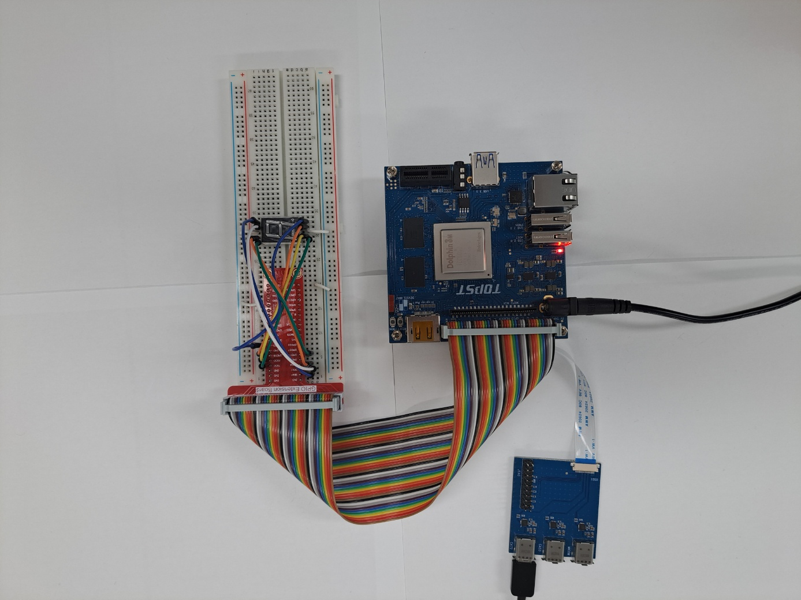
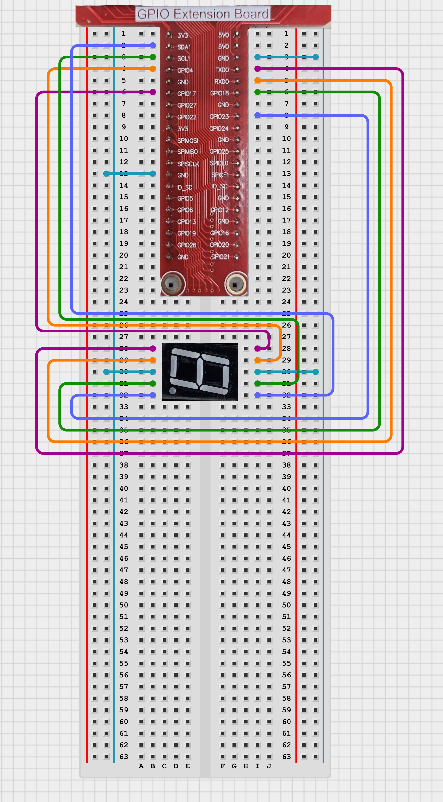

# TOPST D3_ 7-Segment Controller


## Introduction

In this document, we'll control Segment with gpio pin.
<br>
<br>

**1. 7-Segment**<br>
    : To control the state of 8-segment (Display numbers from 1 to 10) using the D3 board
    
There are two ways to write code. <br>
The **first method** is to write and operate the GPIO code directly **without using libraries**. Use the first method to verify the fundamental operation of the board.<Br> 
The **second method** is to **use libraries**. Libraries allow you to operate components more conveniently<br>

Additionally,<br>
You can find Library at 00_Base_Library Documentary. When you want to learn more deeply reference them.


## Materials
|DEVICE|MODEL NAME|NUM|
|:------:|:------:|:------:|
|TOPST BOARD|D3|1|
|7-segment||1|
|GPIO Extention Board||1|
|WIRE|||


## Circuit Picture
<p align="center">

</p>
<p align="center">

</p>

### D3 BOARD

|PIN Number|PIN Name|Opponent's PIN|Connect Device|PIN Number|PIN Name|Opponent's PIN|Connect Device|
|:------:|:------:|:------:|------|:------:|:------:|:------:|------|
|5|GPIO81|a|7-seg|8|GPIO87|e|7-seg|
|3|GPIO82|b|7-seg|10|GPIO88|d|7-seg|
|7|GPIO83|f|7-seg|12|GPIO89|c|7-seg|
|11|GPIO84|g|7-seg|16|GPIO90|dp|7-seg|
|6|GND|GND|7-seg|25|GND|GND|7-seg|


## GPIO Pin Map
<br>
<p align="center">


<BR>

## 1. Code _ 7-Segment
### Code without using libraries

```python
import sys
import os
import time
import signal

# Define paths for GPIO operations
GPIO_EXPORT_PATH = "/sys/class/gpio/export"
GPIO_UNEXPORT_PATH = '/sys/class/gpio/unexport'
GPIO_DIRECTION_PATH_TEMPLATE = '/sys/class/gpio/gpio{}/direction'
GPIO_VALUE_PATH_TEMPLATE = '/sys/class/gpio/gpio{}/value'
GPIO_BASE_PATH_TEMPLATE = '/sys/class/gpio/gpio{}'

# Check if the GPIO is already exported by verifying the base path
def is_gpio_exported(gpio_number): 
    gpio_base_path = GPIO_BASE_PATH_TEMPLATE.format(gpio_number)
    return os.path.exists(gpio_base_path)

# Export the GPIO if the base path does not exist
def export_gpio(gpio_number):
    if not is_gpio_exported(gpio_number):
        try:
            with open(GPIO_EXPORT_PATH, 'w') as export_file:
                export_file.write(str(gpio_number))
        except IOError as e:
            print(f"Error exporting GPIO: {e}")
            sys.exit(1)

# Unexport the GPIO
def unexport_gpio(gpio_number):
    try:
        with open(GPIO_UNEXPORT_PATH, 'w') as unexport_file:
            unexport_file.write(str(gpio_number))
    except IOError as e:
        print(f"Error unexporting GPIO: {e}")
        sys.exit(1)

# Set the direction of the GPIO (e.g., 'in' or 'out')
def set_gpio_direction(gpio_number, direction):
    gpio_direction_path = GPIO_DIRECTION_PATH_TEMPLATE.format(gpio_number)
    try:
        with open(gpio_direction_path, 'w') as direction_file:
            direction_file.write(direction)
    except IOError as e:
        print(f"Error setting GPIO direction: {e}")
        sys.exit(1)

# Set the value of the GPIO (e.g., 1 or 0)
def set_gpio_value(gpio_number, value):
    gpio_value_path = GPIO_VALUE_PATH_TEMPLATE.format(gpio_number)
    try:
        with open(gpio_value_path, 'w') as value_file:
            value_file.write(str(value))
    except IOError as e:
        print(f"Error setting GPIO value: {e}")
        sys.exit(1)
```


The GPIO Initialization Functions are **essential functions** that must always be included beforehand. <br>
***If you want to use these more conveniently, please use the distributed library.***
<br>
<br>


- Function to turn on 7-segment
```python
#GPIO PIN NUMBER
a = 81
b = 82
c = 89
d = 88
e = 87
f = 83
g = 84
dp = 90

 ...

for i in range(len(gpio)):
  export_gpio(gpio[i])
  set_gpio_direction(gpio[i], "out")

for i in range(len(gpio_array)):
  gpio_num_on(gpio_array[i])
  time.sleep(1)
  gpio_num_off(gpio_array[i])    
```
- Main code starts here
```python
if __name__ == "__main__":

    if len(sys.argv) != 1:
        print(f"Usage: {sys.argv[0]}")
        sys.exit(1)

    try:
        for i in range(len(gpio)):
            export_gpio(gpio[i])
            set_gpio_direction(gpio[i], "out")

        for i in range(len(gpio_array)):
            gpio_num_on(gpio_array[i])
            time.sleep(1)
            gpio_num_off(gpio_array[i])          
        
    except KeyboardInterrupt:
        for i in range(len(gpio_array)):
            gpio_num_off(gpio_array[i])
    finally:
        for i in range(len(gpio)):
            unexport_gpio(gpio[i])

    sys.exit(0)
```
<br>

**To run this script, you would use:**

```python
python script_name
```
For example:
```python
python segment.py 
```

<br>

### Code When using libraries
- Library
```python
from .. import GPIO_Library as gpio

num_array=[
    [0,1,2,3,4,5], #0
    [1,2], #1
    [0,1,3,4,6], #2
    [0,1,2,3,6], #3
    [1,2,5,6], #4
    [0,2,3,5,6], #5
    [0,2,3,4,5,6], #6
    [0,1,2], #7
    [0,1,2,3,4,5,6], #8
    [0,1,2,3,5,6] #9
]

# regist device gpio pins
def set_device(gpio_pins):
    for pin in gpio_pins:
        gpio.export(pin)
        gpio.set_direction(pin, 'out')
        gpio.set_value(pin, 0)

# unregist device gpio pins
def quit_device(gpio_pins):
    for pin in gpio_pins:
        gpio.unexport(pin)

# turn off all display
def display_off(gpio_pins):
    for pin in gpio_pins:
        gpio.set_value(pin, 0)

# display number
def display_num(gpio_pins, num):
    for i in num_array[num]:
        gpio.set_value(gpio_pins[i], 1)

# display data
def display_on(data):
    for pin in data:
        gpio.set_value(pin, 1)
```
- Controller
```python
from ..Library.Module import Segment_Library as segment

# connected segment gpio pins
gpio_pins = [81,82,89,88,87,83,84,90]

# data => display 9
data = [81,82,89,88,83,84]

if __name__ == "__main__":
    segment.set_device(gpio_pins) # regist device
    for i in range(9):
        segment.display_num(gpio_pins, i) # display number 0~8
    segment.display_on(data) # display number 9

    segment.quit_device(gpio_pins) # unregist device
```
**To run this script, you would use:**

Be sure to download script file at **00_Base_Library**.

Location of scripts can cause error.

When you write script yourself, modify **import path**.

```
cd {parent directory path which can include library and controller both}
python3 -m {controller script path}
```

For example:
```
cd TOPST
python3 -m TOPST.Controller.Segment_Controller
```
<br>

## Result Mov
- 7-segment<br>


